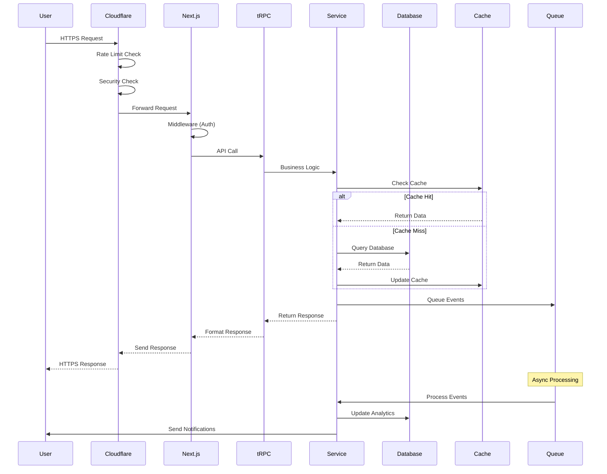

# 🏛️ Sparkle Universe - Project Architecture Document

**Version 1.0 | Date: July 31, 2025**

## 📋 Table of Contents

1. [Executive Summary](#executive-summary)
2. [Architecture Overview](#architecture-overview)
3. [Design Principles](#design-principles)
4. [Technology Stack Deep Dive](#technology-stack-deep-dive)
5. [System Architecture](#system-architecture)
6. [Data Architecture](#data-architecture)
7. [API Architecture](#api-architecture)
8. [Security Architecture](#security-architecture)
9. [Performance Architecture](#performance-architecture)
10. [Frontend Architecture](#frontend-architecture)
11. [Backend Architecture](#backend-architecture)
12. [Real-time Architecture](#real-time-architecture)
13. [Development Guidelines](#development-guidelines)
14. [Step-by-Step Implementation Guide](#step-by-step-implementation-guide)
15. [Testing Strategy](#testing-strategy)
16. [Deployment Architecture](#deployment-architecture)
17. [Monitoring & Observability](#monitoring--observability)
18. [Disaster Recovery](#disaster-recovery)

## Executive Summary

This document serves as the definitive architectural blueprint for Sparkle Universe, a next-generation community platform for Sparkle YouTube fans. It provides comprehensive technical guidance for developers to build, maintain, and scale the platform while adhering to best practices and architectural principles.

### Document Purpose

- **Blueprint**: Complete technical specification for implementation
- **Reference**: Authoritative source for architectural decisions
- **Guide**: Step-by-step instructions for developers
- **Standards**: Coding and design standards enforcement

### Key Architectural Decisions

1. **Microservices-Ready Monolith**: Start with a well-structured monolith that can be decomposed into microservices
2. **Edge-First Design**: Leverage edge computing for global performance
3. **Event-Driven Architecture**: Use event sourcing for complex state management
4. **API-First Development**: Design APIs before implementation
5. **Progressive Enhancement**: Build for resilience and accessibility

## Architecture Overview

### High-Level Architecture

```
┌─────────────────────────────────────────────────────────────────────────┐
│                              Client Layer                                │
│  ┌────────────┐  ┌────────────┐  ┌────────────┐  ┌─────────────────┐  │
│  │    Web     │  │   Mobile   │  │  Desktop   │  │  External APIs  │  │
│  │ (Next.js)  │  │ (React     │  │ (Electron) │  │  (Webhooks)     │  │
│  │            │  │  Native)   │  │            │  │                 │  │
│  └──────┬─────┘  └─────┬──────┘  └─────┬──────┘  └────────┬────────┘  │
└─────────┼──────────────┼───────────────┼───────────────────┼───────────┘
          │              │               │                   │
          ▼              ▼               ▼                   ▼
┌─────────────────────────────────────────────────────────────────────────┐
│                           API Gateway Layer                              │
│  ┌─────────────────────────────────────────────────────────────────┐   │
│  │                    Cloudflare Edge Network                       │   │
│  │  ┌─────────────┐  ┌──────────────┐  ┌───────────────────────┐  │   │
│  │  │ Rate Limiter│  │ WAF/Security │  │ Load Balancer         │  │   │
│  │  └─────────────┘  └──────────────┘  └───────────────────────┘  │   │
│  └─────────────────────────────────────────────────────────────────┘   │
└─────────────────────────────────────────────────────────────────────────┘
                                    │
                                    ▼
┌─────────────────────────────────────────────────────────────────────────┐
│                         Application Layer                                │
│  ┌─────────────────────────────────────────────────────────────────┐   │
│  │                      Next.js Application                         │   │
│  │  ┌──────────────┐  ┌──────────────┐  ┌────────────────────┐   │   │
│  │  │ App Router   │  │ API Routes   │  │ Middleware         │   │   │
│  │  │ (React RSC)  │  │ (tRPC)       │  │ (Auth/Security)    │   │   │
│  │  └──────────────┘  └──────────────┘  └────────────────────┘   │   │
│  └─────────────────────────────────────────────────────────────────┘   │
└─────────────────────────────────────────────────────────────────────────┘
                                    │
                                    ▼
┌─────────────────────────────────────────────────────────────────────────┐
│                           Service Layer                                  │
│  ┌───────────────┐  ┌────────────────┐  ┌─────────────────────────┐   │
│  │ Auth Service  │  │ User Service   │  │ Content Service         │   │
│  ├───────────────┤  ├────────────────┤  ├─────────────────────────┤   │
│  │ Analytics     │  │ Notification   │  │ YouTube Integration     │   │
│  │ Service       │  │ Service        │  │ Service                 │   │
│  ├───────────────┤  ├────────────────┤  ├─────────────────────────┤   │
│  │ AI/ML Service │  │ Real-time      │  │ Gamification Service    │   │
│  │               │  │ Service        │  │                         │   │
│  └───────────────┘  └────────────────┘  └─────────────────────────┘   │
└─────────────────────────────────────────────────────────────────────────┘
                                    │
                                    ▼
┌─────────────────────────────────────────────────────────────────────────┐
│                            Data Layer                                    │
│  ┌────────────────┐  ┌────────────────┐  ┌─────────────────────────┐  │
│  │  PostgreSQL    │  │  Redis Cache   │  │  S3 Object Storage      │  │
│  │  (Primary DB)  │  │  (Session/     │  │  (Media/Files)          │  │
│  │                │  │   Real-time)   │  │                         │  │
│  ├────────────────┤  ├────────────────┤  ├─────────────────────────┤  │
│  │  Elasticsearch │  │  Message Queue │  │  CDN                    │  │
│  │  (Search)      │  │  (Bull/Redis)  │  │  (CloudFront)           │  │
│  └────────────────┘  └────────────────┘  └─────────────────────────┘  │
└─────────────────────────────────────────────────────────────────────────┘
```

### Component Interaction Flow



## Design Principles

### 1. Domain-Driven Design (DDD)

```typescript
// src/domain/user/entities/user.entity.ts
export class User {
  private constructor(
    private readonly id: UserId,
    private email: Email,
    private username: Username,
    private profile: UserProfile,
    private settings: UserSettings
  ) {}

  static create(props: CreateUserProps): Result<User> {
    // Domain validation logic
    const emailOrError = Email.create(props.email);
    if (emailOrError.isFailure) {
      return Result.fail(emailOrError.error);
    }
    // ... more validation
    return Result.ok(new User(...));
  }

  // Domain methods
  updateProfile(updates: ProfileUpdates): Result<void> {
    // Business logic here
  }

  // Domain events
  addDomainEvent(event: DomainEvent): void {
    this.domainEvents.push(event);
  }
}
```

### 2. Clean Architecture Layers

```
src/
├── domain/              # Enterprise Business Rules
│   ├── user/           # User aggregate
│   ├── content/        # Content aggregate
│   └── gamification/   # Gamification aggregate
├── application/         # Application Business Rules
│   ├── use-cases/      # Use case implementations
│   └── services/       # Application services
├── infrastructure/      # Frameworks & Drivers
│   ├── db/            # Database implementation
│   ├── api/           # External API clients
│   └── messaging/     # Message queue implementation
└── presentation/        # Interface Adapters
    ├── api/           # REST/GraphQL/tRPC
    └── web/           # React components
```

### 3. SOLID Principles

#### Single Responsibility
```typescript
// src/services/email/email.service.ts
export class EmailService {
  constructor(private readonly mailer: IMailer) {}
  
  async sendWelcomeEmail(user: User): Promise<void> {
    // Only responsible for sending welcome emails
  }
}

// src/services/notification/notification.service.ts
export class NotificationService {
  constructor(
    private readonly emailService: EmailService,
    private readonly pushService: PushService
  ) {}
  
  async notifyUser(notification: Notification): Promise<void> {
    // Orchestrates different notification channels
  }
}
```

#### Open/Closed Principle
```typescript
// src/services/storage/storage.interface.ts
export interface IStorageService {
  upload(file: File): Promise<FileUrl>;
  delete(url: FileUrl): Promise<void>;
}

// src/services/storage/s3.storage.ts
export class S3StorageService implements IStorageService {
  // S3 implementation
}

// src/services/storage/cloudinary.storage.ts
export class CloudinaryStorageService implements IStorageService {
  // Cloudinary implementation
}
```

### 4. Event-Driven Architecture

```typescript
// src/events/domain-events.ts
export abstract class DomainEvent {
  public dateTimeOccurred: Date;
  public aggregateId: string;

  constructor(aggregateId: string) {
    this.dateTimeOccurred = new Date();
    this.aggregateId = aggregateId;
  }

  abstract getEventName(): string;
}

// src/events/user/user-created.event.ts
export class UserCreatedEvent extends DomainEvent {
  constructor(
    public readonly userId: string,
    public readonly email: string,
    public readonly username: string
  ) {
    super(userId);
  }

  getEventName(): string {
    return 'user.created';
  }
}

// src/events/handlers/user-created.handler.ts
export class UserCreatedHandler implements IEventHandler<UserCreatedEvent> {
  constructor(
    private readonly emailService: EmailService,
    private readonly analyticsService: AnalyticsService
  ) {}

  async handle(event: UserCreatedEvent): Promise<void> {
    // Send welcome email
    await this.emailService.sendWelcomeEmail(event);
    
    // Track analytics
    await this.analyticsService.track('user_signup', {
      userId: event.userId
    });
  }
}
```

## Technology Stack Deep Dive

### Frontend Technologies

#### Next.js 15 with App Router
```typescript
// src/app/layout.tsx
import { Metadata } from 'next'

export const metadata: Metadata = {
  title: 'Sparkle Universe',
  description: 'Where fans become stars',
}

export default function RootLayout({
  children,
}: {
  children: React.ReactNode
}) {
  return (
    <html lang="en">
      <body>
        <Providers>
          {children}
        </Providers>
      </body>
    </html>
  )
}
```

#### TypeScript Configuration
```json
// tsconfig.json
{
  "compilerOptions": {
    "target": "ES2022",
    "lib": ["dom", "dom.iterable", "esnext"],
    "allowJs": true,
    "skipLibCheck": true,
    "strict": true,
    "forceConsistentCasingInFileNames": true,
    "noEmit": true,
    "esModuleInterop": true,
    "module": "esnext",
    "moduleResolution": "bundler",
    "resolveJsonModule": true,
    "isolatedModules": true,
    "jsx": "preserve",
    "incremental": true,
    "plugins": [
      {
        "name": "next"
      }
    ],
    "paths": {
      "@/*": ["./src/*"],
      "@/components/*": ["./src/components/*"],
      "@/lib/*": ["./src/lib/*"],
      "@/hooks/*": ["./src/hooks/*"],
      "@/types/*": ["./src/types/*"],
      "@/server/*": ["./src/server/*"]
    }
  },
  "include": ["next-env.d.ts", "**/*.ts", "**/*.tsx", ".next/types/**/*.ts"],
  "exclude": ["node_modules"]
}
```

#### Tailwind CSS Configuration
```typescript
// tailwind.config.ts
import type { Config } from 'tailwindcss'

const config: Config = {
  darkMode: 'class',
  content: [
    './src/**/*.{js,ts,jsx,tsx,mdx}',
  ],
  theme: {
    extend: {
      colors: {
        sparkle: {
          50: '#fff0f0',
          100: '#ffe0e0',
          // ... complete color palette
          900: '#7f1d1d',
        },
      },
      animation: {
        'sparkle': 'sparkle 3s linear infinite',
        'glow': 'glow 2s ease-in-out infinite alternate',
        'float': 'float 6s ease-in-out infinite',
      },
      keyframes: {
        sparkle: {
          '0%, 100%': { opacity: '0' },
          '50%': { opacity: '1' },
        },
        glow: {
          'from': { boxShadow: '0 0 10px #ff6b6b, 0 0 20px #ff6b6b' },
          'to': { boxShadow: '0 0 20px #ff6b6b, 0 0 30px #ff6b6b' },
        },
        float: {
          '0%, 100%': { transform: 'translateY(0)' },
          '50%': { transform: 'translateY(-20px)' },
        },
      },
    },
  },
  plugins: [
    require('@tailwindcss/forms'),
    require('@tailwindcss/typography'),
    require('tailwindcss-animate'),
  ],
}

export default config
```

### Backend Technologies

#### Prisma Schema Design
```prisma
// =====================================================
// Sparkle Universe Complete Prisma Schema
// Version 3.0 - Enhanced Performance & Feature Complete
// =====================================================

generator client {
  provider        = "prisma-client-js"
  previewFeatures = ["jsonProtocol", "fullTextSearch", "fullTextIndex", "postgresqlExtensions"]
}

datasource db {
  provider   = "postgresql"
  url        = env("DATABASE_URL")
  extensions = [pgcrypto, pg_trgm, uuid_ossp]
}

// =====================================================
// ENUMS
// =====================================================

enum UserRole {
  USER
  MODERATOR
  ADMIN
  CREATOR
  VERIFIED_CREATOR
  SYSTEM
}

enum UserStatus {
  PENDING_VERIFICATION
  ACTIVE
  SUSPENDED
  BANNED
  DELETED
}

enum NotificationType {
  POST_LIKED
  POST_COMMENTED
  COMMENT_LIKED
  USER_FOLLOWED
  ACHIEVEMENT_UNLOCKED
  LEVEL_UP
  MENTION
  SYSTEM
  GROUP_INVITE
  GROUP_POST
  EVENT_REMINDER
  WATCH_PARTY_INVITE
  DIRECT_MESSAGE
  YOUTUBE_PREMIERE
  QUEST_COMPLETE
  TRADE_REQUEST
  CONTENT_FEATURED
  MILESTONE_REACHED
}

enum ReactionType {
  LIKE
  LOVE
  FIRE
  SPARKLE
  MIND_BLOWN
  LAUGH
  CRY
  ANGRY
  CUSTOM
}

enum ReportReason {
  SPAM
  INAPPROPRIATE
  HARASSMENT
  MISINFORMATION
  COPYRIGHT
  NSFW
  HATE_SPEECH
  SELF_HARM
  OTHER
}

enum ModerationStatus {
  PENDING
  APPROVED
  REJECTED
  ESCALATED
  AUTO_APPROVED
  SHADOW_BANNED
  UNDER_REVIEW
}

enum ContentType {
  BLOG
  LIVE_BLOG
  POLL
  VIDEO_REVIEW
  FAN_ART
  THEORY_THREAD
  SERIES
  TUTORIAL
  NEWS
}

enum ContentStatus {
  DRAFT
  SCHEDULED
  PUBLISHED
  ARCHIVED
  DELETED
}

enum BadgeRarity {
  COMMON
  UNCOMMON
  RARE
  EPIC
  LEGENDARY
  MYTHIC
  LIMITED_EDITION
  SEASONAL
}

enum QuestType {
  DAILY
  WEEKLY
  MONTHLY
  SPECIAL
  ACHIEVEMENT
  SEASONAL
  COMMUNITY
  CREATOR
}

enum QuestStatus {
  AVAILABLE
  IN_PROGRESS
  COMPLETED
  CLAIMED
  EXPIRED
  LOCKED
}

enum TradeStatus {
  PENDING
  ACCEPTED
  REJECTED
  CANCELLED
  EXPIRED
  COMPLETED
  DISPUTED
}

enum MessageStatus {
  SENT
  DELIVERED
  READ
  DELETED
}

enum EventType {
  WATCH_PARTY
  COMMUNITY_MEETUP
  CONTEST
  PREMIERE
  AMA
  SPECIAL
  TOURNAMENT
  WORKSHOP
}

enum EventStatus {
  DRAFT
  SCHEDULED
  LIVE
  ENDED
  CANCELLED
}

enum GroupVisibility {
  PUBLIC
  PRIVATE
  INVITE_ONLY
  HIDDEN
}

enum GroupMemberRole {
  MEMBER
  MODERATOR
  ADMIN
  OWNER
}

enum CacheType {
  USER_PROFILE
  POST_CONTENT
  FEED
  TRENDING
  LEADERBOARD
  STATS
}

enum AuditAction {
  CREATE
  UPDATE
  DELETE
  LOGIN
  LOGOUT
  PERMISSION_CHANGE
  MODERATION_ACTION
  SYSTEM_ACTION
}

enum PaymentStatus {
  PENDING
  PROCESSING
  COMPLETED
  FAILED
  REFUNDED
  CANCELLED
}

enum SubscriptionTier {
  FREE
  SPARKLE_FAN
  SPARKLE_CREATOR
  SPARKLE_LEGEND
}

// =====================================================
// CORE MODELS
// =====================================================

model User {
  id                    String               @id @default(cuid())
  email                 String               @unique
  username              String               @unique
  hashedPassword        String?
  emailVerified         DateTime?
  phoneNumber           String?
  phoneVerified         DateTime?
  image                 String?
  bio                   String?              @db.Text
  role                  UserRole             @default(USER)
  status                UserStatus           @default(PENDING_VERIFICATION)
  verified              Boolean              @default(false)
  verifiedAt            DateTime?
  banned                Boolean              @default(false)
  banReason             String?
  banExpiresAt          DateTime?
  experience            Int                  @default(0)
  level                 Int                  @default(1)
  sparklePoints         Int                  @default(0)
  premiumPoints         Int                  @default(0)
  reputationScore       Int                  @default(0)
  lastSeenAt            DateTime?
  onlineStatus          Boolean              @default(false)
  twoFactorEnabled      Boolean              @default(false)
  twoFactorSecret       String?
  preferredLanguage     String               @default("en")
  timezone              String               @default("UTC")
  version               Int                  @default(0) // For optimistic locking
  createdAt             DateTime             @default(now())
  updatedAt             DateTime             @updatedAt
  deletedAt             DateTime?

  // Relations
  accounts              Account[]
  sessions              Session[]
  profile               Profile?
  stats                 UserStats?
  balance               UserBalance?
  subscription          UserSubscription?
  posts                 Post[]
  comments              Comment[]
  reactions             Reaction[]
  following             Follow[]             @relation("follower")
  followers             Follow[]             @relation("following")
  blockedUsers          Block[]              @relation("blocker")
  blockedBy             Block[]              @relation("blocked")
  achievements          UserAchievement[]
  notifications         Notification[]       @relation("notificationUser")
  notificationsSent     Notification[]       @relation("notificationActor")
  notificationPrefs     NotificationPreference?
  xpLogs                XpLog[]
  currencyTransactions  CurrencyTransaction[]
  inventory             UserInventory[]
  tradesInitiated       Trade[]              @relation("tradeInitiator")
  tradesReceived        Trade[]              @relation("tradeRecipient")
  questProgress         UserQuest[]
  youtubeChannels       YoutubeChannel[]
  hostedWatchParties    WatchParty[]
  watchPartyParticipants WatchPartyParticipant[]
  videoClips            VideoClip[]
  playlists             Playlist[]
  playlistItems         PlaylistItem[]
  groupsOwned           Group[]
  groupMemberships      GroupMember[]
  eventsHosted          Event[]
  eventAttendances      EventAttendee[]
  conversationsCreated  Conversation[]
  conversationParticipants ConversationParticipant[]
  messages              Message[]
  messageReads          MessageRead[]
  websocketSessions     WebsocketSession[]
  chatRoomsCreated      ChatRoom[]
  chatMessages          ChatMessage[]
  collaborativeSpacesOwned CollaborativeSpace[]
  spaceCollaborations   SpaceCollaborator[]
  activityStreams       ActivityStream[]
  fanArtSubmissions     FanArtSubmission[]
  mediaFiles            MediaFile[]
  experimentAssignments ExperimentAssignment[]
  moderationReviews     AiModerationQueue[]   @relation("moderationReviewer")
  reports               Report[]              @relation("reporter")
  reportResolutions     Report[]              @relation("resolver")
  siteSettingUpdates    SiteSetting[]
  postSeries            PostSeries[]
  auditLogs             AuditLog[]
  apiKeys               ApiKey[]
  webhooks              Webhook[]
  contentRevisions      PostRevision[]
  searchHistory         SearchHistory[]
  viewHistory           ViewHistory[]
  loginHistory          LoginHistory[]
  securityAlerts        SecurityAlert[]
  referralCodeUsed      Referral?            @relation("referredUser")
  referralsMade         Referral[]           @relation("referrer")

  @@index([email])
  @@index([username])
  @@index([role])
  @@index([level])
  @@index([onlineStatus])
  @@index([sparklePoints])
  @@index([status])
  @@index([createdAt])
  @@index([lastSeenAt])
  @@index([deletedAt])
  @@map("users")
}

model UserStats {
  id                  String    @id @default(cuid())
  userId              String    @unique
  totalPosts          Int       @default(0)
  totalComments       Int       @default(0)
  totalLikesReceived  Int       @default(0)
  totalLikesGiven     Int       @default(0)
  totalViews          Int       @default(0)
  totalFollowers      Int       @default(0)
  totalFollowing      Int       @default(0)
  totalWatchTime      BigInt    @default(0) // In seconds
  streakDays          Int       @default(0)
  longestStreak       Int       @default(0)
  lastActivityAt      DateTime?
  profileViews        Int       @default(0)
  engagementRate      Float     @default(0)
  contentQualityScore Float     @default(0)
  updatedAt           DateTime  @updatedAt

  // Relations
  user User @relation(fields: [userId], references: [id], onDelete: Cascade)

  @@index([userId])
  @@index([totalFollowers])
  @@index([engagementRate])
  @@map("user_stats")
}

model UserBalance {
  id                String   @id @default(cuid())
  userId            String   @unique
  sparklePoints     Int      @default(0)
  premiumPoints     Int      @default(0)
  frozenPoints      Int      @default(0) // Points in pending trades
  lifetimeEarned    Int      @default(0)
  lifetimeSpent     Int      @default(0)
  version           Int      @default(0) // For optimistic locking
  lastTransactionAt DateTime?
  updatedAt         DateTime @updatedAt

  // Relations
  user User @relation(fields: [userId], references: [id], onDelete: Cascade)

  @@index([userId])
  @@map("user_balances")
}

model UserSubscription {
  id                String           @id @default(cuid())
  userId            String           @unique
  tier              SubscriptionTier @default(FREE)
  status            PaymentStatus    @default(PENDING)
  startDate         DateTime         @default(now())
  endDate           DateTime?
  cancelledAt       DateTime?
  paymentMethod     String?
  stripeCustomerId  String?
  stripeSubId       String?
  autoRenew         Boolean          @default(true)
  createdAt         DateTime         @default(now())
  updatedAt         DateTime         @updatedAt

  // Relations
  user User @relation(fields: [userId], references: [id], onDelete: Cascade)

  @@index([userId])
  @@index([status])
  @@index([endDate])
  @@map("user_subscriptions")
}

model Profile {
  id                  String    @id @default(cuid())
  userId              String    @unique
  displayName         String?
  location            String?
  website             String?
  twitterUsername     String?
  instagramUsername   String?
  tiktokUsername      String?
  discordUsername     String?
  youtubeChannelId    String?
  youtubeChannelUrl   String?
  youtubeChannelData  Json?
  bannerImage         String?
  themePreference     Json?
  notificationSettings Json     @default("{}")
  privacySettings     Json     @default("{}")
  featuredBadges      String[]
  showcasedPosts      String[]
  customCss           String?   @db.Text
  customHtml          String?   @db.Text
  socialLinks         Json?
  interests           String[]
  skills              String[]
  pronouns            String?
  birthdate           DateTime?
  joinedCommunityAt   DateTime  @default(now())
  profileCompleted    Boolean   @default(false)
  profileCompleteness Int       @default(0)
  createdAt           DateTime  @default(now())
  updatedAt           DateTime  @updatedAt

  // Relations
  user User @relation(fields: [userId], references: [id], onDelete: Cascade)

  @@index([userId])
  @@index([youtubeChannelId])
  @@index([profileCompleted])
  @@map("profiles")
}

model Account {
  id                String    @id @default(cuid())
  userId            String
  type              String
  provider          String
  providerAccountId String
  refreshToken      String?   @db.Text
  accessToken       String?   @db.Text
  expiresAt         BigInt?
  tokenType         String?
  scope             String?
  idToken           String?   @db.Text
  sessionState      String?
  oauthTokenSecret  String?
  oauthToken        String?
  createdAt         DateTime  @default(now())
  updatedAt         DateTime  @updatedAt

  // Relations
  user User @relation(fields: [userId], references: [id], onDelete: Cascade)

  @@unique([provider, providerAccountId])
  @@index([userId])
  @@map("accounts")
}

model Session {
  id           String   @id @default(cuid())
  sessionToken String   @unique
  userId       String
  expires      DateTime
  ipAddress    String?
  userAgent    String?  @db.Text
  createdAt    DateTime @default(now())
  updatedAt    DateTime @updatedAt

  // Relations
  user User @relation(fields: [userId], references: [id], onDelete: Cascade)

  @@index([userId])
  @@index([sessionToken])
  @@index([expires])
  @@map("sessions")
}

model LoginHistory {
  id         String   @id @default(cuid())
  userId     String
  ipAddress  String
  userAgent  String   @db.Text
  location   String?
  success    Boolean
  reason     String?
  createdAt  DateTime @default(now())

  // Relations
  user User @relation(fields: [userId], references: [id], onDelete: Cascade)

  @@index([userId, createdAt(sort: Desc)])
  @@map("login_history")
}

model SecurityAlert {
  id          String   @id @default(cuid())
  userId      String
  type        String
  severity    String
  title       String
  description String   @db.Text
  resolved    Boolean  @default(false)
  resolvedAt  DateTime?
  createdAt   DateTime @default(now())

  // Relations
  user User @relation(fields: [userId], references: [id], onDelete: Cascade)

  @@index([userId, resolved])
  @@index([severity])
  @@map("security_alerts")
}

model ApiKey {
  id          String    @id @default(cuid())
  userId      String
  name        String
  key         String    @unique
  permissions String[]
  expiresAt   DateTime?
  lastUsedAt  DateTime?
  createdAt   DateTime  @default(now())
  revokedAt   DateTime?

  // Relations
  user User @relation(fields: [userId], references: [id], onDelete: Cascade)

  @@index([userId])
  @@index([key])
  @@map("api_keys")
}

model Webhook {
  id           String   @id @default(cuid())
  userId       String
  name         String
  url          String
  secret       String
  events       String[]
  active       Boolean  @default(true)
  failureCount Int      @default(0)
  lastTriggered DateTime?
  createdAt    DateTime @default(now())
  updatedAt    DateTime @updatedAt

  // Relations
  user User @relation(fields: [userId], references: [id], onDelete: Cascade)

  @@index([userId])
  @@index([active])
  @@map("webhooks")
}

model Block {
  id         String   @id @default(cuid())
  blockerId  String
  blockedId  String
  reason     String?
  createdAt  DateTime @default(now())

  // Relations
  blocker User @relation("blocker", fields: [blockerId], references: [id], onDelete: Cascade)
  blocked User @relation("blocked", fields: [blockedId], references: [id], onDelete: Cascade)

  @@unique([blockerId, blockedId])
  @@index([blockerId])
  @@index([blockedId])
  @@map("blocks")
}

model NotificationPreference {
  id                    String   @id @default(cuid())
  userId                String   @unique
  emailNotifications    Boolean  @default(true)
  pushNotifications     Boolean  @default(true)
  smsNotifications      Boolean  @default(false)
  postLikes             Boolean  @default(true)
  postComments          Boolean  @default(true)
  newFollowers          Boolean  @default(true)
  mentions              Boolean  @default(true)
  directMessages        Boolean  @default(true)
  groupInvites          Boolean  @default(true)
  eventReminders        Boolean  @default(true)
  marketingEmails       Boolean  @default(false)
  weeklyDigest          Boolean  @default(true)
  quietHoursStart       String?  // Format: "HH:MM"
  quietHoursEnd         String?  // Format: "HH:MM"
  createdAt             DateTime @default(now())
  updatedAt             DateTime @updatedAt

  // Relations
  user User @relation(fields: [userId], references: [id], onDelete: Cascade)

  @@index([userId])
  @@map("notification_preferences")
}

model Referral {
  id               String    @id @default(cuid())
  referrerId       String
  referredUserId   String?   @unique
  referralCode     String    @unique
  referredEmail    String?
  status           String    @default("PENDING")
  rewardClaimed    Boolean   @default(false)
  rewardAmount     Int       @default(100)
  expiresAt        DateTime?
  completedAt      DateTime?
  createdAt        DateTime  @default(now())

  // Relations
  referrer     User  @relation("referrer", fields: [referrerId], references: [id], onDelete: Cascade)
  referredUser User? @relation("referredUser", fields: [referredUserId], references: [id], onDelete: SetNull)

  @@index([referrerId])
  @@index([referralCode])
  @@index([status])
  @@map("referrals")
}

// =====================================================
// CONTENT MODELS
// =====================================================

model Category {
  id           String   @id @default(cuid())
  name         String
  slug         String   @unique
  description  String?  @db.Text
  icon         String?
  color        String?
  parentId     String?
  postCount    Int      @default(0)
  displayOrder Int      @default(0)
  isActive     Boolean  @default(true)
  metadata     Json?
  createdAt    DateTime @default(now())
  updatedAt    DateTime @updatedAt

  // Relations
  parent   Category? @relation("CategoryHierarchy", fields: [parentId], references: [id], onDelete: SetNull)
  children Category[] @relation("CategoryHierarchy")
  posts    Post[]

  @@index([slug])
  @@index([parentId])
  @@index([isActive])
  @@map("categories")
}

model Post {
  id                 String         @id @default(cuid())
  slug               String         @unique
  title              String         @db.VarChar(500)
  content            Json
  contentType        ContentType    @default(BLOG)
  contentStatus      ContentStatus  @default(DRAFT)
  excerpt            String?        @db.Text
  coverImage         String?
  coverImageAlt      String?
  authorId           String
  categoryId         String?
  seriesId           String?
  seriesOrder        Int?
  published          Boolean        @default(false)
  featured           Boolean        @default(false)
  editorsPick        Boolean        @default(false)
  sponsoredContent   Boolean        @default(false)
  sponsorInfo        Json?
  isPinned           Boolean        @default(false)
  pinnedUntil        DateTime?
  isDraft            Boolean        @default(true)
  version            Int            @default(1)
  parentVersionId    String?
  collaborators      String[]       // User IDs who can edit
  youtubeVideoId     String?
  youtubeVideoData   Json?
  views              Int            @default(0)
  uniqueViews        Int            @default(0)
  readingTime        Int?           // In minutes
  wordCount          Int?
  metaTitle          String?        @db.VarChar(160)
  metaDescription    String?        @db.VarChar(320)
  metaKeywords       String[]
  ogImage            String?
  canonicalUrl       String?
  customSlug         Boolean        @default(false)
  allowComments      Boolean        @default(true)
  moderationStatus   ModerationStatus @default(PENDING)
  moderationNotes    String?        @db.Text
  scheduledPublishAt DateTime?
  publishedAt        DateTime?
  lastEditedAt       DateTime?
  archivedAt         DateTime?
  deletedAt          DateTime?
  createdAt          DateTime       @default(now())
  updatedAt          DateTime       @updatedAt

  // Relations
  author         User             @relation(fields: [authorId], references: [id], onDelete: Cascade)
  category       Category?        @relation(fields: [categoryId], references: [id], onDelete: SetNull)
  series         PostSeries?      @relation(fields: [seriesId], references: [id], onDelete: SetNull)
  parentVersion  Post?            @relation("PostVersions", fields: [parentVersionId], references: [id], onDelete: SetNull)
  childVersions  Post[]           @relation("PostVersions")
  tags           PostTag[]
  comments       Comment[]
  reactions      Reaction[]
  poll           Poll?
  fanArtGallery  FanArtGallery?
  stats          PostStats?
  revisions      PostRevision[]
  viewHistory    ViewHistory[]
  relatedPosts   PostRelation[]   @relation("relatedPost")
  relatedTo      PostRelation[]   @relation("mainPost")
  mentions       Mention[]
  bookmarks      Bookmark[]

  @@index([slug])
  @@index([authorId])
  @@index([categoryId])
  @@index([seriesId])
  @@index([published, publishedAt(sort: Desc)])
  @@index([featured])
  @@index([contentType])
  @@index([scheduledPublishAt])
  @@index([contentStatus])
  @@index([moderationStatus])
  @@index([deletedAt])
  @@fulltext([title])
  @@map("posts")
}

model PostStats {
  id                String   @id @default(cuid())
  postId            String   @unique
  viewCount         Int      @default(0)
  uniqueViewCount   Int      @default(0)
  likeCount         Int      @default(0)
  loveCount         Int      @default(0)
  fireCount         Int      @default(0)
  totalReactionCount Int     @default(0)
  commentCount      Int      @default(0)
  shareCount        Int      @default(0)
  bookmarkCount     Int      @default(0)
  avgReadTime       Float    @default(0) // In seconds
  bounceRate        Float    @default(0)
  engagementRate    Float    @default(0)
  lastCalculatedAt  DateTime @default(now())
  updatedAt         DateTime @updatedAt

  // Relations
  post Post @relation(fields: [postId], references: [id], onDelete: Cascade)

  @@index([postId])
  @@index([viewCount])
  @@index([totalReactionCount])
  @@index([engagementRate])
  @@map("post_stats")
}

model PostRevision {
  id           String   @id @default(cuid())
  postId       String
  editorId     String
  title        String   @db.VarChar(500)
  content      Json
  changeNote   String?  @db.Text
  version      Int
  isPublished  Boolean  @default(false)
  createdAt    DateTime @default(now())

  // Relations
  post   Post @relation(fields: [postId], references: [id], onDelete: Cascade)
  editor User @relation(fields: [editorId], references: [id], onDelete: Cascade)

  @@index([postId, version])
  @@index([editorId])
  @@map("post_revisions")
}

model PostRelation {
  id            String   @id @default(cuid())
  postId        String
  relatedPostId String
  relationType  String   // "sequel", "prequel", "related", "translation"
  sortOrder     Int      @default(0)
  createdAt     DateTime @default(now())

  // Relations
  post        Post @relation("mainPost", fields: [postId], references: [id], onDelete: Cascade)
  relatedPost Post @relation("relatedPost", fields: [relatedPostId], references: [id], onDelete: Cascade)

  @@unique([postId, relatedPostId])
  @@index([postId])
  @@index([relatedPostId])
  @@map("post_relations")
}

model PostSeries {
  id           String   @id @default(cuid())
  title        String
  slug         String   @unique
  description  String?  @db.Text
  authorId     String
  coverImage   String?
  bannerImage  String?
  totalParts   Int      @default(0)
  completed    Boolean  @default(false)
  featured     Boolean  @default(false)
  metadata     Json?
  createdAt    DateTime @default(now())
  updatedAt    DateTime @updatedAt

  // Relations
  author User   @relation(fields: [authorId], references: [id], onDelete: Cascade)
  posts  Post[]

  @@index([authorId])
  @@index([slug])
  @@index([featured])
  @@map("post_series")
}

model Tag {
  id          String   @id @default(cuid())
  name        String   @unique
  slug        String   @unique
  description String?  @db.Text
  color       String?
  icon        String?
  postCount   Int      @default(0)
  featured    Boolean  @default(false)
  category    String?
  synonyms    String[]
  createdAt   DateTime @default(now())

  // Relations
  posts PostTag[]

  @@index([name])
  @@index([slug])
  @@index([featured])
  @@index([postCount])
  @@map("tags")
}

model PostTag {
  postId    String
  tagId     String
  addedBy   String?
  createdAt DateTime @default(now())

  // Relations
  post Post @relation(fields: [postId], references: [id], onDelete: Cascade)
  tag  Tag  @relation(fields: [tagId], references: [id], onDelete: Cascade)

  @@id([postId, tagId])
  @@index([postId])
  @@index([tagId])
  @@map("post_tags")
}

model Comment {
  id                String           @id @default(cuid())
  content           String           @db.Text
  postId            String
  authorId          String
  parentId          String?
  youtubeTimestamp  Int?
  quotedTimestamp   String?          // For quoting specific video moments
  edited            Boolean          @default(false)
  editedAt          DateTime?
  editHistory       Json[]           // Store previous versions
  deleted           Boolean          @default(false)
  deletedAt         DateTime?
  deletedBy         String?
  pinned            Boolean          @default(false)
  featured          Boolean          @default(false)
  moderationStatus  ModerationStatus @default(AUTO_APPROVED)
  moderationNotes   String?
  ipAddress         String?
  userAgent         String?
  version           Int              @default(0)
  createdAt         DateTime         @default(now())
  updatedAt         DateTime         @updatedAt

  // Relations
  post      Post       @relation(fields: [postId], references: [id], onDelete: Cascade)
  author    User       @relation(fields: [authorId], references: [id], onDelete: Cascade)
  parent    Comment?   @relation("CommentReplies", fields: [parentId], references: [id], onDelete: Cascade)
  replies   Comment[]  @relation("CommentReplies")
  reactions Reaction[]
  mentions  Mention[]

  @@index([postId])
  @@index([authorId])
  @@index([parentId])
  @@index([youtubeTimestamp])
  @@index([moderationStatus])
  @@index([deleted])
  @@map("comments")
}

model Reaction {
  id          String       @id @default(cuid())
  type        ReactionType
  postId      String?
  commentId   String?
  userId      String
  customEmoji String?      // For CUSTOM type
  metadata    Json?
  createdAt   DateTime     @default(now())

  // Relations
  post    Post?    @relation(fields: [postId], references: [id], onDelete: Cascade)
  comment Comment? @relation(fields: [commentId], references: [id], onDelete: Cascade)
  user    User     @relation(fields: [userId], references: [id], onDelete: Cascade)

  @@unique([postId, userId, type])
  @@unique([commentId, userId, type])
  @@index([postId])
  @@index([commentId])
  @@index([userId])
  @@index([type])
  @@map("reactions")
}

model Mention {
  id           String   @id @default(cuid())
  mentionerId  String
  mentionedId  String
  postId       String?
  commentId    String?
  context      String?  @db.Text
  acknowledged Boolean  @default(false)
  createdAt    DateTime @default(now())

  // Relations
  mentioner User     @relation(fields: [mentionerId], references: [id], onDelete: Cascade)
  mentioned User     @relation(fields: [mentionedId], references: [id], onDelete: Cascade)
  post      Post?    @relation(fields: [postId], references: [id], onDelete: Cascade)
  comment   Comment? @relation(fields: [commentId], references: [id], onDelete: Cascade)

  @@index([mentionedId])
  @@index([postId])
  @@index([commentId])
  @@map("mentions")
}

model Bookmark {
  id         String   @id @default(cuid())
  userId     String
  postId     String
  folderId   String?
  notes      String?  @db.Text
  tags       String[]
  createdAt  DateTime @default(now())

  // Relations
  user   User            @relation(fields: [userId], references: [id], onDelete: Cascade)
  post   Post            @relation(fields: [postId], references: [id], onDelete: Cascade)
  folder BookmarkFolder? @relation(fields: [folderId], references: [id], onDelete: SetNull)

  @@unique([userId, postId])
  @@index([userId])
  @@index([postId])
  @@index([folderId])
  @@map("bookmarks")
}

model BookmarkFolder {
  id          String     @id @default(cuid())
  userId      String
  name        String
  description String?
  color       String?
  icon        String?
  isPublic    Boolean    @default(false)
  sortOrder   Int        @default(0)
  createdAt   DateTime   @default(now())
  updatedAt   DateTime   @updatedAt

  // Relations
  user      User       @relation(fields: [userId], references: [id], onDelete: Cascade)
  bookmarks Bookmark[]

  @@unique([userId, name])
  @@index([userId])
  @@map("bookmark_folders")
}

model Follow {
  id             String    @id @default(cuid())
  followerId     String
  followingId    String
  notifyNewPosts Boolean   @default(true)
  notifyActivity Boolean   @default(false)
  createdAt      DateTime  @default(now())

  // Relations
  follower  User @relation("follower", fields: [followerId], references: [id], onDelete: Cascade)
  following User @relation("following", fields: [followingId], references: [id], onDelete: Cascade)

  @@unique([followerId, followingId])
  @@index([followerId])
  @@index([followingId])
  @@map("follows")
}

model ViewHistory {
  id           String    @id @default(cuid())
  userId       String
  postId       String
  viewDuration Int       @default(0) // In seconds
  scrollDepth  Float     @default(0) // Percentage
  referrer     String?
  deviceType   String?
  createdAt    DateTime  @default(now())

  // Relations
  user User @relation(fields: [userId], references: [id], onDelete: Cascade)
  post Post @relation(fields: [postId], references: [id], onDelete: Cascade)

  @@index([userId, createdAt(sort: Desc)])
  @@index([postId])
  @@map("view_history")
}

model SearchHistory {
  id          String   @id @default(cuid())
  userId      String?
  query       String
  resultCount Int      @default(0)
  clickedResults String[]
  searchType  String?  // "posts", "users", "tags", etc.
  deviceType  String?
  createdAt   DateTime @default(now())

  // Relations
  user User? @relation(fields: [userId], references: [id], onDelete: SetNull)

  @@index([userId])
  @@index([query])
  @@index([createdAt])
  @@map("search_history")
}

// =====================================================
// NOTIFICATION MODELS
// =====================================================

model Notification {
  id           String           @id @default(cuid())
  type         NotificationType
  userId       String
  actorId      String?
  entityId     String?
  entityType   String?
  title        String
  message      String           @db.Text
  data         Json?
  imageUrl     String?
  actionUrl    String?
  priority     Int              @default(0) // 0=low, 1=normal, 2=high
  read         Boolean          @default(false)
  readAt       DateTime?
  clicked      Boolean          @default(false)
  clickedAt    DateTime?
  emailSent    Boolean          @default(false)
  pushSent     Boolean          @default(false)
  smsSent      Boolean          @default(false)
  dismissed    Boolean          @default(false)
  dismissedAt  DateTime?
  expiresAt    DateTime?
  createdAt    DateTime         @default(now())

  // Relations
  user  User  @relation("notificationUser", fields: [userId], references: [id], onDelete: Cascade)
  actor User? @relation("notificationActor", fields: [actorId], references: [id], onDelete: SetNull)

  @@index([userId, read, createdAt(sort: Desc)])
  @@index([actorId])
  @@index([type])
  @@index([priority])
  @@index([expiresAt])
  @@map("notifications")
}

model NotificationQueue {
  id            String   @id @default(cuid())
  userId        String
  type          String
  channel       String   // "email", "push", "sms"
  payload       Json
  priority      Int      @default(0)
  attempts      Int      @default(0)
  maxAttempts   Int      @default(3)
  scheduledFor  DateTime @default(now())
  processedAt   DateTime?
  failedAt      DateTime?
  error         String?  @db.Text
  createdAt     DateTime @default(now())

  @@index([scheduledFor, processedAt])
  @@index([userId])
  @@index([priority])
  @@map("notification_queue")
}

// =====================================================
// GAMIFICATION MODELS
// =====================================================

model Achievement {
  id                   String      @id @default(cuid())
  code                 String      @unique
  name                 String
  description          String?     @db.Text
  shortDescription     String?
  icon                 String?
  animatedIcon         String?
  bannerImage          String?
  xpReward             Int         @default(0)
  sparklePointsReward  Int         @default(0)
  premiumPointsReward  Int         @default(0)
  rarity               BadgeRarity @default(COMMON)
  category             String?
  subcategory          String?
  criteria             Json?
  progressSteps        Int         @default(1)
  isSecret             Boolean     @default(false)
  prerequisiteIds      String[]
  displayOrder         Int         @default(0)
  seasonal             Boolean     @default(false)
  eventBased           Boolean     @default(false)
  limited              Boolean     @default(false)
  maxAchievers         Int?        // For limited edition
  expiresAt            DateTime?
  metadata             Json?
  createdAt            DateTime    @default(now())
  updatedAt            DateTime    @updatedAt

  // Relations
  userAchievements UserAchievement[]

  @@index([code])
  @@index([category])
  @@index([rarity])
  @@map("achievements")
}

model UserAchievement {
  id              String   @id @default(cuid())
  userId          String
  achievementId   String
  progress        Float    @default(0) // 0 to 1
  progressData    Json?
  unlockedAt      DateTime @default(now())
  showcased       Boolean  @default(false)
  showcaseOrder   Int      @default(0)
  notified        Boolean  @default(false)
  claimedRewards  Boolean  @default(false)

  // Relations
  user        User        @relation(fields: [userId], references: [id], onDelete: Cascade)
  achievement Achievement @relation(fields: [achievementId], references: [id], onDelete: Cascade)

  @@unique([userId, achievementId])
  @@index([userId])
  @@index([userId, showcased])
  @@index([achievementId])
  @@map("user_achievements")
}

model XpLog {
  id          String   @id @default(cuid())
  userId      String
  amount      Int
  source      String   // "post_create", "comment", "like_received", etc.
  sourceId    String?  // Reference to the source entity
  reason      String?
  multiplier  Float    @default(1)
  bonusXp     Int      @default(0)
  totalXp     Int      // Total XP after this transaction
  metadata    Json?
  createdAt   DateTime @default(now())

  // Relations
  user User @relation(fields: [userId], references: [id], onDelete: Cascade)

  @@index([userId, createdAt(sort: Desc)])
  @@index([source])
  @@map("xp_logs")
}

model LevelConfig {
  level           Int      @id
  requiredXp      Int
  title           String
  perks           String[]
  sparkleReward   Int      @default(0)
  premiumReward   Int      @default(0)
  unlockFeatures  String[]
  badgeId         String?
  createdAt       DateTime @default(now())

  @@index([requiredXp])
  @@map("level_configs")
}

model CurrencyTransaction {
  id              String   @id @default(cuid())
  userId          String
  amount          Int
  currencyType    String   // "sparkle", "premium"
  transactionType String   // "earn", "spend", "transfer", "refund"
  source          String   // "achievement", "purchase", "trade", etc.
  sourceId        String?
  description     String?
  referenceId     String?
  referenceType   String?
  balanceBefore   Int
  balanceAfter    Int
  metadata        Json?
  createdAt       DateTime @default(now())

  // Relations
  user User @relation(fields: [userId], references: [id], onDelete: Cascade)

  @@index([userId, createdAt(sort: Desc)])
  @@index([transactionType])
  @@index([source])
  @@map("currency_transactions")
}

model StoreItem {
  id                 String    @id @default(cuid())
  sku                String    @unique
  name               String
  description        String?   @db.Text
  shortDescription   String?
  category           String
  subcategory        String?
  itemType           String    // "avatar", "badge", "theme", "reaction", etc.
  rarity             BadgeRarity @default(COMMON)
  priceSparkle       Int?
  pricePremium       Int?
  originalPriceSparkle Int?
  originalPricePremium Int?
  discountPercentage Int       @default(0)
  previewUrl         String?
  thumbnailUrl       String?
  images             String[]
  data               Json?     // Item-specific data
  requirements       Json?     // Level, achievement requirements
  limitedEdition     Boolean   @default(false)
  stockRemaining     Int?
  maxPerUser         Int?
  featured           Boolean   @default(false)
  new                Boolean   @default(false)
  availableFrom      DateTime?
  availableUntil     DateTime?
  metadata           Json?
  createdAt          DateTime  @default(now())
  updatedAt          DateTime  @updatedAt

  // Relations
  inventory UserInventory[]
  bundles   StoreBundle[]   @relation("BundleItems")

  @@index([category])
  @@index([featured])
  @@index([availableFrom, availableUntil])
  @@map("store_items")
}

model StoreBundle {
  id                 String    @id @default(cuid())
  name               String
  description        String?
  priceSparkle       Int?
  pricePremium       Int?
  discountPercentage Int       @default(0)
  items              StoreItem[] @relation("BundleItems")
  availableFrom      DateTime?
  availableUntil     DateTime?
  maxPurchases       Int?
  createdAt          DateTime  @default(now())

  @@index([availableFrom, availableUntil])
  @@map("store_bundles")
}

model UserInventory {
  id            String    @id @default(cuid())
  userId        String
  itemId        String
  quantity      Int       @default(1)
  equipped      Boolean   @default(false)
  equippedAt    DateTime?
  customData    Json?     // User customizations
  acquiredFrom  String    // "purchase", "achievement", "gift", etc.
  acquiredAt    DateTime  @default(now())
  expiresAt     DateTime?
  tradeable     Boolean   @default(true)
  giftedBy      String?

  // Relations
  user User      @relation(fields: [userId], references: [id], onDelete: Cascade)
  item StoreItem @relation(fields: [itemId], references: [id], onDelete: Cascade)

  @@unique([userId, itemId])
  @@index([userId])
  @@index([userId, equipped])
  @@index([itemId])
  @@map("user_inventory")
}

model Trade {
  id              String      @id @default(cuid())
  initiatorId     String
  recipientId     String
  status          TradeStatus @default(PENDING)
  initiatorItems  Json        // Array of {itemId, quantity}
  recipientItems  Json        // Array of {itemId, quantity}
  initiatorPoints Int         @default(0)
  recipientPoints Int         @default(0)
  message         String?     @db.Text
  responseMessage String?     @db.Text
  tradeValue      Int         @default(0) // Estimated value
  escrowId        String?     // For secure trading
  expiresAt       DateTime    @default(dbgenerated("(CURRENT_TIMESTAMP + interval '7 days')"))
  respondedAt     DateTime?
  completedAt     DateTime?
  cancelledAt     DateTime?
  cancelReason    String?
  createdAt       DateTime    @default(now())
  updatedAt       DateTime    @updatedAt

  // Relations
  initiator User @relation("tradeInitiator", fields: [initiatorId], references: [id], onDelete: Cascade)
  recipient User @relation("tradeRecipient", fields: [recipientId], references: [id], onDelete: Cascade)

  @@index([initiatorId, status])
  @@index([recipientId, status])
  @@index([status])
  @@map("trades")
}

model Quest {
  id               String    @id @default(cuid())
  code             String    @unique
  name             String
  description      String?   @db.Text
  shortDescription String?
  icon             String?
  bannerImage      String?
  type             QuestType
  category         String?
  difficulty       String?   // "easy", "medium", "hard", "epic"
  requirements     Json      // Quest completion criteria
  rewards          Json      // Rewards specification
  xpReward         Int       @default(0)
  pointsReward     Int       @default(0)
  prerequisiteIds  String[]  // Required quests
  levelRequired    Int       @default(1)
  cooldownHours    Int?      // For repeatable quests
  maxCompletions   Int       @default(1)
  timeLimit        Int?      // In minutes
  availableFrom    DateTime?
  availableUntil   DateTime?
  metadata         Json?
  createdAt        DateTime  @default(now())
  updatedAt        DateTime  @updatedAt

  // Relations
  userQuests UserQuest[]

  @@index([type])
  @@index([availableFrom, availableUntil])
  @@map("quests")
}

model UserQuest {
  id            String      @id @default(cuid())
  userId        String
  questId       String
  status        QuestStatus @default(AVAILABLE)
  progress      Json        @default("{}")
  currentStep   Int         @default(0)
  totalSteps    Int         @default(1)
  startedAt     DateTime    @default(now())
  completedAt   DateTime?
  claimedAt     DateTime?
  expiresAt     DateTime?
  attemptCount  Int         @default(1)
  bestTime      Int?        // In seconds
  metadata      Json?

  // Relations
  user  User  @relation(fields: [userId], references: [id], onDelete: Cascade)
  quest Quest @relation(fields: [questId], references: [id], onDelete: Cascade)

  @@unique([userId, questId])
  @@index([userId, status])
  @@index([questId])
  @@index([status])
  @@map("user_quests")
}

model Leaderboard {
  id          String   @id @default(cuid())
  type        String   // "xp", "sparkle", "posts", "achievements", etc.
  scope       String   // "global", "regional", "group"
  scopeId     String?  // Group ID, region code, etc.
  period      String   // "daily", "weekly", "monthly", "alltime"
  periodStart DateTime
  periodEnd   DateTime
  data        Json     // Sorted leaderboard data
  metadata    Json?
  processed   Boolean  @default(false)
  createdAt   DateTime @default(now())

  @@unique([type, scope, scopeId, periodStart, periodEnd])
  @@index([type, periodEnd(sort: Desc)])
  @@index([processed])
  @@map("leaderboards")
}

model LeaderboardEntry {
  id          String   @id @default(cuid())
  userId      String
  type        String
  period      String
  rank        Int
  score       BigInt
  movement    Int      @default(0) // Rank change from previous period
  metadata    Json?
  createdAt   DateTime @default(now())

  @@unique([userId, type, period])
  @@index([type, period, rank])
  @@index([userId])
  @@map("leaderboard_entries")
}

// =====================================================
// YOUTUBE INTEGRATION MODELS
// =====================================================

model YoutubeChannel {
  id                   String    @id @default(cuid())
  channelId            String    @unique
  userId               String?
  channelTitle         String?
  channelHandle        String?
  channelDescription   String?   @db.Text
  channelData          Json?
  thumbnailUrl         String?
  bannerUrl            String?
  subscriberCount      BigInt    @default(0)
  viewCount            BigInt    @default(0)
  videoCount           Int       @default(0)
  lastVideoId          String?
  lastVideoTitle       String?
  lastVideoPublishedAt DateTime?
  lastSyncedAt         DateTime?
  syncEnabled          Boolean   @default(true)
  featured             Boolean   @default(false)
  verified             Boolean   @default(false)
  metadata             Json?
  createdAt            DateTime  @default(now())
  updatedAt            DateTime  @updatedAt

  // Relations
  user   User?           @relation(fields: [userId], references: [id], onDelete: SetNull)
  videos YoutubeVideo[]

  @@index([userId])
  @@index([channelId])
  @@index([featured])
  @@map("youtube_channels")
}

model YoutubeVideo {
  id                 String    @id @default(cuid())
  videoId            String    @unique
  channelId          String
  youtubeChannelId   String?
  title              String?   @db.VarChar(500)
  description        String?   @db.Text
  thumbnailUrl       String?
  thumbnailUrlHd     String?
  duration           Int?      // In seconds
  durationFormatted  String?   // "HH:MM:SS"
  viewCount          BigInt    @default(0)
  likeCount          Int       @default(0)
  commentCount       Int       @default(0)
  tags               String[]
  categoryId         String?
  liveBroadcast      Boolean   @default(false)
  premiereDate       DateTime?
  publishedAt        DateTime?
  metadata           Json?
  lastSyncedAt       DateTime?
  createdAt          DateTime  @default(now())

  // Relations
  channel      YoutubeChannel? @relation(fields: [youtubeChannelId], references: [id], onDelete: SetNull)
  watchParties WatchParty[]
  clips        VideoClip[]
  analytics    VideoAnalytics?

  @@index([channelId])
  @@index([publishedAt(sort: Desc)])
  @@index([viewCount])
  @@map("youtube_videos")
}

model VideoAnalytics {
  id                  String   @id @default(cuid())
  videoId             String   @unique
  watchTime           BigInt   @default(0) // Total seconds watched
  avgWatchTime        Float    @default(0)
  completionRate      Float    @default(0)
  engagementRate      Float    @default(0)
  clipCount           Int      @default(0)
  shareCount          Int      @default(0)
  discussionCount     Int      @default(0)
  sentimentScore      Float?   // -1 to 1
  topDiscussionTopics String[]
  peakViewers         Int      @default(0)
  updatedAt           DateTime @updatedAt

  // Relations
  video YoutubeVideo @relation(fields: [videoId], references: [videoId], onDelete: Cascade)

  @@index([videoId])
  @@map("video_analytics")
}

model WatchParty {
  id                String       @id @default(cuid())
  hostId            String
  title             String
  description       String?      @db.Text
  youtubeVideoId    String
  youtubeVideoUrl   String?
  scheduledStart    DateTime
  actualStart       DateTime?
  endedAt           DateTime?
  maxParticipants   Int          @default(50)
  currentParticipants Int        @default(0)
  isPublic          Boolean      @default(true)
  requiresApproval  Boolean      @default(false)
  chatEnabled       Boolean      @default(true)
  syncPlayback      Boolean      @default(true)
  allowGuestChat    Boolean      @default(false)
  recordChat        Boolean      @default(true)
  tags              String[]
  customEmotes      Json?
  partyCode         String?      @unique
  cancelledAt       DateTime?
  cancelReason      String?
  metadata          Json?
  createdAt         DateTime     @default(now())
  updatedAt         DateTime     @updatedAt

  // Relations
  host         User                     @relation(fields: [hostId], references: [id], onDelete: Cascade)
  video        YoutubeVideo?            @relation(fields: [youtubeVideoId], references: [videoId], onDelete: SetNull)
  participants WatchPartyParticipant[]
  chat         WatchPartyChat[]

  @@index([hostId])
  @@index([scheduledStart])
  @@index([isPublic, scheduledStart])
  @@index([partyCode])
  @@map("watch_parties")
}

model WatchPartyParticipant {
  id               String    @id @default(cuid())
  partyId          String
  userId           String
  role             String    @default("viewer") // "host", "moderator", "viewer"
  joinedAt         DateTime  @default(now())
  leftAt           DateTime?
  isActive         Boolean   @default(true)
  playbackPosition Int       @default(0)
  isMuted          Boolean   @default(false)
  isBanned         Boolean   @default(false)
  bannedAt         DateTime?
  banReason        String?
  messageCount     Int       @default(0)
  reactionCount    Int       @default(0)

  // Relations
  party WatchParty @relation(fields: [partyId], references: [id], onDelete: Cascade)
  user  User       @relation(fields: [userId], references: [id], onDelete: Cascade)

  @@unique([partyId, userId])
  @@index([partyId, isActive])
  @@index([userId])
  @@map("watch_party_participants")
}

model WatchPartyChat {
  id          String    @id @default(cuid())
  partyId     String
  userId      String
  message     String    @db.Text
  timestamp   Int       // Video timestamp when message was sent
  replyToId   String?
  reactions   Json?     // Quick reactions to messages
  deleted     Boolean   @default(false)
  deletedAt   DateTime?
  deletedBy   String?
  createdAt   DateTime  @default(now())

  // Relations
  party   WatchParty      @relation(fields: [partyId], references: [id], onDelete: Cascade)
  user    User            @relation(fields: [userId], references: [id], onDelete: Cascade)
  replyTo WatchPartyChat? @relation("WatchPartyChatReplies", fields: [replyToId], references: [id], onDelete: SetNull)
  replies WatchPartyChat[] @relation("WatchPartyChatReplies")

  @@index([partyId, createdAt])
  @@index([userId])
  @@map("watch_party_chat")
}

model VideoClip {
  id             String   @id @default(cuid())
  youtubeVideoId String
  creatorId      String
  title          String
  description    String?  @db.Text
  startTime      Int      // In seconds
  endTime        Int      // In seconds
  duration       Int      // Calculated: endTime - startTime
  thumbnailUrl   String?
  tags           String[]
  viewCount      Int      @default(0)
  likeCount      Int      @default(0)
  shareCount     Int      @default(0)
  featured       Boolean  @default(false)
  metadata       Json?
  createdAt      DateTime @default(now())

  // Relations
  video   YoutubeVideo? @relation(fields: [youtubeVideoId], references: [videoId], onDelete: SetNull)
  creator User          @relation(fields: [creatorId], references: [id], onDelete: Cascade)

  @@index([youtubeVideoId])
  @@index([creatorId])
  @@index([viewCount])
  @@map("video_clips")
}

model Playlist {
  id              String   @id @default(cuid())
  title           String
  slug            String   @unique
  description     String?  @db.Text
  ownerId         String
  isCollaborative Boolean  @default(false)
  collaboratorIds String[]
  isPublic        Boolean  @default(true)
  coverImage      String?
  tags            String[]
  viewCount       Int      @default(0)
  likeCount       Int      @default(0)
  followerCount   Int      @default(0)
  itemCount       Int      @default(0)
  totalDuration   Int      @default(0) // In seconds
  featured        Boolean  @default(false)
  metadata        Json?
  createdAt       DateTime @default(now())
  updatedAt       DateTime @updatedAt

  // Relations
  owner User           @relation(fields: [ownerId], references: [id], onDelete: Cascade)
  items PlaylistItem[]

  @@index([ownerId])
  @@index([isPublic])
  @@index([slug])
  @@map("playlists")
}

model PlaylistItem {
  id             String   @id @default(cuid())
  playlistId     String
  youtubeVideoId String
  addedBy        String
  position       Int
  note           String?  @db.Text
  customTitle    String?
  startTime      Int?     // Custom start time
  endTime        Int?     // Custom end time
  addedAt        DateTime @default(now())

  // Relations
  playlist Playlist @relation(fields: [playlistId], references: [id], onDelete: Cascade)
  user     User     @relation(fields: [addedBy], references: [id], onDelete: Cascade)

  @@unique([playlistId, position])
  @@index([playlistId])
  @@index([addedBy])
  @@map("playlist_items")
}

model YouTubeApiQuota {
  id            String   @id @default(cuid())
  date          DateTime @default(dbgenerated("CURRENT_DATE"))
  unitsUsed     Int      @default(0)
  quotaLimit    Int      @default(10000)
  readRequests  Int      @default(0)
  writeRequests Int      @default(0)
  searchRequests Int     @default(0)
  resetAt       DateTime
  
  @@unique([date])
  @@index([date])
  @@map("youtube_api_quota")
}

// =====================================================
// SOCIAL FEATURES MODELS
// =====================================================

model Group {
  id              String          @id @default(cuid())
  name            String
  slug            String          @unique
  description     String?         @db.Text
  shortDescription String?
  bannerImage     String?
  icon            String?
  coverImage      String?
  ownerId         String
  visibility      GroupVisibility @default(PUBLIC)
  joinApproval    Boolean         @default(false)
  memberCount     Int             @default(1)
  postCount       Int             @default(0)
  onlineCount     Int             @default(0)
  rules           String?         @db.Text
  guidelines      Json?
  tags            String[]
  categories      String[]
  settings        Json            @default("{}")
  features        String[]        // Enabled features for the group
  customEmojis    Json?
  isOfficial      Boolean         @default(false)
  isVerified      Boolean         @default(false)
  isFeatured      Boolean         @default(false)
  metadata        Json?
  createdAt       DateTime        @default(now())
  updatedAt       DateTime        @updatedAt

  // Relations
  owner    User          @relation(fields: [ownerId], references: [id], onDelete: Cascade)
  members  GroupMember[]
  events   Event[]
  posts    GroupPost[]
  channels GroupChannel[]

  @@index([slug])
  @@index([ownerId])
  @@index([visibility])
  @@index([isFeatured])
  @@map("groups")
}

model GroupMember {
  id            String          @id @default(cuid())
  groupId       String
  userId        String
  role          GroupMemberRole @default(MEMBER)
  permissions   String[]
  joinedAt      DateTime        @default(now())
  invitedBy     String?
  approvedBy    String?
  mutedUntil    DateTime?
  bannedUntil   DateTime?
  banReason     String?
  contribution  Int             @default(0) // Group-specific points
  lastActiveAt  DateTime        @default(now())
  notifications Boolean         @default(true)

  // Relations
  group Group @relation(fields: [groupId], references: [id], onDelete: Cascade)
  user  User  @relation(fields: [userId], references: [id], onDelete: Cascade)

  @@unique([groupId, userId])
  @@index([groupId, role])
  @@index([userId])
  @@map("group_members")
}

model GroupPost {
  id               String           @id @default(cuid())
  groupId          String
  authorId         String
  title            String?
  content          String           @db.Text
  isPinned         Boolean          @default(false)
  isAnnouncement   Boolean          @default(false)
  allowComments    Boolean          @default(true)
  viewCount        Int              @default(0)
  reactionCount    Int              @default(0)
  commentCount     Int              @default(0)
  moderationStatus ModerationStatus @default(AUTO_APPROVED)
  createdAt        DateTime         @default(now())
  updatedAt        DateTime         @updatedAt

  // Relations
  group  Group @relation(fields: [groupId], references: [id], onDelete: Cascade)
  author User  @relation(fields: [authorId], references: [id], onDelete: Cascade)

  @@index([groupId, createdAt(sort: Desc)])
  @@index([authorId])
  @@map("group_posts")
}

model GroupChannel {
  id          String   @id @default(cuid())
  groupId     String
  name        String
  description String?
  type        String   // "text", "voice", "announcement"
  position    Int      @default(0)
  permissions Json?
  createdAt   DateTime @default(now())

  // Relations
  group Group @relation(fields: [groupId], references: [id], onDelete: Cascade)

  @@unique([groupId, name])
  @@index([groupId])
  @@map("group_channels")
}

model Event {
  id               String       @id @default(cuid())
  title            String
  slug             String       @unique
  description      String?      @db.Text
  shortDescription String?
  type             EventType
  status           EventStatus  @default(SCHEDULED)
  hostId           String
  cohostIds        String[]
  groupId          String?
  locationName     String?
  locationUrl      String?
  locationAddress  String?
  locationCoords   Json?        // {lat, lng}
  isVirtual        Boolean      @default(false)
  virtualPlatform  String?      // "zoom", "discord", "youtube", etc.
  virtualLink      String?
  bannerImage      String?
  thumbnailImage   String?
  startTime        DateTime
  endTime          DateTime
  timezone         String       @default("UTC")
  recurrence       Json?        // Recurrence rules
  maxAttendees     Int?
  currentAttendees Int          @default(0)
  minAttendees     Int?
  isPublic         Boolean      @default(true)
  requiresApproval Boolean      @default(false)
  requiresPayment  Boolean      @default(false)
  price            Int?
  currency         String?
  tags             String[]
  categories       String[]
  agenda           Json?
  speakers         Json?
  sponsors         Json?
  streamUrl        String?
  recordingUrl     String?
  materials        Json?        // Links to materials
  feedback         Json?        // Post-event feedback settings
  remindersSent    String[]     // Track which reminders have been sent
  metadata         Json?
  cancelledAt      DateTime?
  cancelReason     String?
  createdAt        DateTime     @default(now())
  updatedAt        DateTime     @updatedAt

  // Relations
  host      User            @relation(fields: [hostId], references: [id], onDelete: Cascade)
  group     Group?          @relation(fields: [groupId], references: [id], onDelete: SetNull)
  attendees EventAttendee[]

  @@index([hostId])
  @@index([groupId])
  @@index([startTime])
  @@index([isPublic, startTime])
  @@index([status])
  @@index([slug])
  @@map("events")
}

model EventAttendee {
  id              String    @id @default(cuid())
  eventId         String
  userId          String
  status          String    @default("INTERESTED") // "INTERESTED", "GOING", "NOT_GOING", "WAITLISTED"
  role            String    @default("ATTENDEE") // "ATTENDEE", "SPEAKER", "ORGANIZER", "VOLUNTEER"
  approved        Boolean   @default(true)
  approvedAt      DateTime?
  approvedBy      String?
  checkInTime     DateTime?
  checkInMethod   String?   // "manual", "qr", "auto"
  attended        Boolean   @default(false)
  rating          Int?      // Post-event rating 1-5
  feedback        String?   @db.Text
  certificateId   String?   // For events that issue certificates
  notes           String?   @db.Text
  remindersSent   Boolean   @default(false)
  createdAt       DateTime  @default(now())

  // Relations
  event Event @relation(fields: [eventId], references: [id], onDelete: Cascade)
  user  User  @relation(fields: [userId], references: [id], onDelete: Cascade)

  @@unique([eventId, userId])
  @@index([eventId, status])
  @@index([userId])
  @@map("event_attendees")
}

// =====================================================
// MESSAGING MODELS
// =====================================================

model Conversation {
  id                String   @id @default(cuid())
  isGroup           Boolean  @default(false)
  title             String?
  description       String?
  icon              String?
  encryptedKey      String?  @db.Text
  lastMessageId     String?
  lastMessageAt     DateTime?
  messageCount      Int      @default(0)
  createdBy         String
  settings          Json     @default("{}")
  pinnedMessages    String[]
  isArchived        Boolean  @default(false)
  archivedAt        DateTime?
  deletedAt         DateTime?
  createdAt         DateTime @default(now())
  updatedAt         DateTime @updatedAt

  // Relations
  creator      User                      @relation(fields: [createdBy], references: [id], onDelete: Cascade)
  participants ConversationParticipant[]
  messages     Message[]

  @@index([createdBy])
  @@index([lastMessageAt])
  @@map("conversations")
}

model ConversationParticipant {
  id                 String    @id @default(cuid())
  conversationId     String
  userId             String
  nickname           String?
  role               String    @default("member") // "admin", "member"
  joinedAt           DateTime  @default(now())
  leftAt             DateTime?
  isActive           Boolean   @default(true)
  lastReadAt         DateTime?
  lastReadMessageId  String?
  unreadCount        Int       @default(0)
  notificationsMuted Boolean   @default(false)
  mutedUntil         DateTime?
  isPinned           Boolean   @default(false)
  customSettings     Json?

  // Relations
  conversation Conversation @relation(fields: [conversationId], references: [id], onDelete: Cascade)
  user         User         @relation(fields: [userId], references: [id], onDelete: Cascade)

  @@unique([conversationId, userId])
  @@index([conversationId])
  @@index([userId])
  @@index([userId, isPinned])
  @@map("conversation_participants")
}

model Message {
  id              String        @id @default(cuid())
  conversationId  String
  senderId        String
  content         String?       @db.Text
  encryptedContent String?      @db.Text
  messageType     String        @default("TEXT") // "TEXT", "IMAGE", "VIDEO", "FILE", "AUDIO", "SYSTEM"
  attachments     Json?         // Array of attachment objects
  mentions        String[]      // User IDs mentioned
  replyToId       String?
  forwardedFrom   String?
  reactions       Json?         // { "👍": ["userId1", "userId2"], ... }
  metadata        Json?
  edited          Boolean       @default(false)
  editedAt        DateTime?
  editHistory     Json[]
  deleted         Boolean       @default(false)
  deletedAt       DateTime?
  deletedFor      String[]      // User IDs who deleted this message
  status          MessageStatus @default(SENT)
  deliveredAt     DateTime?
  errorMessage    String?
  createdAt       DateTime      @default(now())

  // Relations
  conversation Conversation  @relation(fields: [conversationId], references: [id], onDelete: Cascade)
  sender       User          @relation(fields: [senderId], references: [id], onDelete: Cascade)
  replyTo      Message?      @relation("MessageReplies", fields: [replyToId], references: [id], onDelete: SetNull)
  replies      Message[]     @relation("MessageReplies")
  reads        MessageRead[]

  @@index([conversationId, createdAt(sort: Desc)])
  @@index([senderId])
  @@map("messages")
}

model MessageRead {
  messageId String
  userId    String
  readAt    DateTime @default(now())

  // Relations
  message Message @relation(fields: [messageId], references: [id], onDelete: Cascade)
  user    User    @relation(fields: [userId], references: [id], onDelete: Cascade)

  @@id([messageId, userId])
  @@index([userId])
  @@map("message_reads")
}

// =====================================================
// REAL-TIME SUPPORT MODELS
// =====================================================

model WebsocketSession {
  id           String   @id @default(cuid())
  userId       String
  socketId     String   @unique
  ipAddress    String?
  userAgent    String?  @db.Text
  deviceType   String?
  location     String?
  connectedAt  DateTime @default(now())
  lastPingAt   DateTime @default(now())
  disconnectReason String?

  // Relations
  user User @relation(fields: [userId], references: [id], onDelete: Cascade)

  @@index([userId])
  @@index([socketId])
  @@map("websocket_sessions")
}

model ChatRoom {
  id           String   @id @default(cuid())
  name         String
  slug         String   @unique
  description  String?  @db.Text
  topic        String?
  tags         String[]
  isPublic     Boolean  @default(true)
  isModerated  Boolean  @default(false)
  isPersistent Boolean  @default(true) // False for temporary rooms
  maxUsers     Int      @default(100)
  activeUsers  Int      @default(0)
  totalMessages Int     @default(0)
  slowMode     Int      @default(0) // Seconds between messages
  customEmojis Json?
  rules        String?  @db.Text
  welcomeMessage String?
  pinnedMessage String?
  blockedWords String[]
  createdBy    String
  moderatorIds String[]
  expiresAt    DateTime? // For temporary rooms
  lastActiveAt DateTime @default(now())
  createdAt    DateTime @default(now())

  // Relations
  creator  User          @relation(fields: [createdBy], references: [id], onDelete: Cascade)
  messages ChatMessage[]

  @@index([slug])
  @@index([isPublic])
  @@index([lastActiveAt])
  @@map("chat_rooms")
}

model ChatMessage {
  id           String    @id @default(cuid())
  roomId       String
  userId       String
  content      String    @db.Text
  mentions     String[]
  attachments  Json?
  replyToId    String?
  systemMessage Boolean  @default(false)
  highlighted  Boolean  @default(false)
  reactions    Json?    // { "👍": 5, "❤️": 3 }
  edited       Boolean  @default(false)
  editedAt     DateTime?
  deleted      Boolean  @default(false)
  deletedAt    DateTime?
  deletedBy    String?
  flagged      Boolean  @default(false)
  flagReason   String?
  createdAt    DateTime @default(now())

  // Relations
  room    ChatRoom     @relation(fields: [roomId], references: [id], onDelete: Cascade)
  user    User         @relation(fields: [userId], references: [id], onDelete: Cascade)
  replyTo ChatMessage? @relation("ChatMessageReplies", fields: [replyToId], references: [id], onDelete: SetNull)
  replies ChatMessage[] @relation("ChatMessageReplies")

  @@index([roomId, createdAt(sort: Desc)])
  @@index([userId])
  @@map("chat_messages")
}

model CollaborativeSpace {
  id               String   @id @default(cuid())
  type             String   // "document", "whiteboard", "code", "canvas"
  title            String
  description      String?  @db.Text
  ownerId          String
  content          Json?
  version          Int      @default(1)
  isPublic         Boolean  @default(false)
  isTemplate       Boolean  @default(false)
  allowAnonymous   Boolean  @default(false)
  maxCollaborators Int      @default(10)
  activeUsers      Int      @default(0)
  editPermission   String   @default("collaborators") // "owner", "collaborators", "anyone"
  viewPermission   String   @default("anyone") // "owner", "collaborators", "anyone"
  forkable         Boolean  @default(true)
  forkCount        Int      @default(0)
  parentId         String?  // For forked spaces
  tags             String[]
  lastEditedAt     DateTime @default(now())
  createdAt        DateTime @default(now())
  updatedAt        DateTime @updatedAt

  // Relations
  owner         User                @relation(fields: [ownerId], references: [id], onDelete: Cascade)
  collaborators SpaceCollaborator[]

  @@index([ownerId])
  @@index([type])
  @@index([isPublic])
  @@map("collaborative_spaces")
}

model SpaceCollaborator {
  id            String   @id @default(cuid())
  spaceId       String
  userId        String
  role          String   @default("editor") // "viewer", "editor", "admin"
  canEdit       Boolean  @default(true)
  canComment    Boolean  @default(true)
  canInvite     Boolean  @default(false)
  lastActiveAt  DateTime @default(now())
  joinedAt      DateTime @default(now())
  invitedBy     String?

  // Relations
  space CollaborativeSpace @relation(fields: [spaceId], references: [id], onDelete: Cascade)
  user  User               @relation(fields: [userId], references: [id], onDelete: Cascade)

  @@unique([spaceId, userId])
  @@index([spaceId])
  @@index([userId])
  @@map("space_collaborators")
}

model PresenceTracking {
  id            String   @id @default(cuid())
  userId        String
  location      String   // "post:123", "room:abc", "space:xyz"
  locationType  String   // "post", "room", "space", "profile"
  deviceId      String?
  status        String   @default("active") // "active", "idle", "away"
  lastActiveAt  DateTime @default(now())
  metadata      Json?    // Additional context

  @@unique([userId, location])
  @@index([location])
  @@index([userId])
  @@map("presence_tracking")
}

// =====================================================
// ACTIVITY & ANALYTICS MODELS
// =====================================================

model ActivityStream {
  id         String   @id @default(cuid())
  userId     String
  action     String   // "post.created", "user.followed", "achievement.unlocked"
  entityType String   // "post", "user", "comment", etc.
  entityId   String
  entityData Json?    // Snapshot of entity at time of action
  metadata   Json?
  visibility String   @default("PUBLIC") // "PUBLIC", "FOLLOWERS", "PRIVATE"
  ipAddress  String?
  userAgent  String?
  createdAt  DateTime @default(now())

  // Relations
  user User @relation(fields: [userId], references: [id], onDelete: Cascade)

  @@index([userId, createdAt(sort: Desc)])
  @@index([entityType, entityId])
  @@index([action])
  @@map("activity_streams")
}

model UserActivity {
  id               String   @id @default(cuid())
  userId           String   @unique
  date             DateTime @default(dbgenerated("CURRENT_DATE"))
  loginCount       Int      @default(0)
  pageViews        Int      @default(0)
  postsCreated     Int      @default(0)
  postsViewed      Int      @default(0)
  commentsCreated  Int      @default(0)
  reactionsGiven   Int      @default(0)
  messagessSent    Int      @default(0)
  minutesActive    Int      @default(0)
  xpEarned         Int      @default(0)
  pointsEarned     Int      @default(0)
  achievementsUnlocked Int  @default(0)

  @@unique([userId, date])
  @@index([date])
  @@map("user_activity")
}

model ContentPerformance {
  id               String   @id @default(cuid())
  contentType      String   // "post", "comment", "video"
  contentId        String
  date             DateTime @default(dbgenerated("CURRENT_DATE"))
  impressions      Int      @default(0)
  uniqueImpressions Int     @default(0)
  clicks           Int      @default(0)
  engagements      Int      @default(0)
  shares           Int      @default(0)
  avgTimeSpent     Float    @default(0)
  bounceRate       Float    @default(0)
  viralityScore    Float    @default(0)

  @@unique([contentType, contentId, date])
  @@index([contentType, date])
  @@index([viralityScore])
  @@map("content_performance")
}

// =====================================================
// CONTENT VARIATION MODELS
// =====================================================

model Poll {
  id              String    @id @default(cuid())
  postId          String    @unique
  question        String    @db.Text
  multipleChoice  Boolean   @default(false)
  anonymousVoting Boolean   @default(false)
  showResults     String    @default("after_vote") // "always", "after_vote", "after_close"
  requireComment  Boolean   @default(false)
  minChoices      Int       @default(1)
  maxChoices      Int       @default(1)
  closeAt         DateTime?
  finalResults    Json?     // Cached final results
  createdAt       DateTime  @default(now())

  // Relations
  post    Post         @relation(fields: [postId], references: [id], onDelete: Cascade)
  options PollOption[]
  votes   PollVote[]

  @@index([postId])
  @@map("polls")
}

model PollOption {
  id           String   @id @default(cuid())
  pollId       String
  optionText   String   @db.Text
  description  String?
  imageUrl     String?
  displayOrder Int
  voteCount    Int      @default(0)
  percentage   Float    @default(0)
  metadata     Json?

  // Relations
  poll  Poll       @relation(fields: [pollId], references: [id], onDelete: Cascade)
  votes PollVote[]

  @@index([pollId])
  @@map("poll_options")
}

model PollVote {
  id        String   @id @default(cuid())
  pollId    String
  optionIds String[] // Support for multiple choice
  userId    String
  comment   String?  @db.Text
  ipAddress String?
  metadata  Json?
  createdAt DateTime @default(now())

  // Relations
  poll   Poll       @relation(fields: [pollId], references: [id], onDelete: Cascade)
  option PollOption @relation(fields: [optionIds[0]], references: [id], onDelete: Cascade)
  user   User       @relation(fields: [userId], references: [id], onDelete: Cascade)

  @@unique([pollId, userId])
  @@index([pollId])
  @@index([userId])
  @@map("poll_votes")
}

model FanArtGallery {
  id                    String    @id @default(cuid())
  postId                String    @unique
  theme                 String?
  rules                 String?   @db.Text
  prizes                Json?
  submissionDeadline    DateTime?
  votingDeadline        DateTime?
  votingEnabled         Boolean   @default(true)
  publicVoting          Boolean   @default(true)
  maxSubmissionsPerUser Int       @default(3)
  requireApproval       Boolean   @default(false)
  allowNSFW             Boolean   @default(false)
  winnerCount           Int       @default(3)
  winnersAnnounced      Boolean   @default(false)
  metadata              Json?
  createdAt             DateTime  @default(now())

  // Relations
  post        Post               @relation(fields: [postId], references: [id], onDelete: Cascade)
  submissions FanArtSubmission[]

  @@index([postId])
  @@map("fan_art_galleries")
}

model FanArtSubmission {
  id               String           @id @default(cuid())
  galleryId        String
  artistId         String
  title            String
  description      String?          @db.Text
  imageUrl         String
  thumbnailUrl     String?
  highResUrl       String?
  fileSize         Int?
  dimensions       Json?            // {width, height}
  medium           String?          // "digital", "traditional", "mixed"
  tools            String[]         // Software/materials used
  timeSpent        Int?             // In hours
  voteCount        Int              @default(0)
  avgRating        Float            @default(0)
  viewCount        Int              @default(0)
  featured         Boolean          @default(false)
  winner           Boolean          @default(false)
  winnerRank       Int?
  moderationStatus ModerationStatus @default(PENDING)
  moderationNotes  String?
  metadata         Json?
  createdAt        DateTime         @default(now())

  // Relations
  gallery FanArtGallery @relation(fields: [galleryId], references: [id], onDelete: Cascade)
  artist  User          @relation(fields: [artistId], references: [id], onDelete: Cascade)

  @@index([galleryId])
  @@index([artistId])
  @@index([voteCount])
  @@map("fan_art_submissions")
}

// =====================================================
// MODERATION & SAFETY MODELS
// =====================================================

model Report {
  id             String           @id @default(cuid())
  reporterId     String
  reportedUserId String?
  reason         ReportReason
  subreason      String?
  description    String?          @db.Text
  evidence       Json?            // Screenshots, links, etc.
  status         ModerationStatus @default(PENDING)
  priority       Int              @default(0) // 0=low, 1=normal, 2=high, 3=urgent
  assignedTo     String?
  resolvedBy     String?
  resolvedAt     DateTime?
  resolution     String?          // "warning", "ban", "no_action", etc.
  resolutionNote String?          @db.Text
  appealable     Boolean          @default(true)
  entityType     String           // "user", "post", "comment", etc.
  entityId       String
  metadata       Json?
  createdAt      DateTime         @default(now())
  updatedAt      DateTime         @updatedAt

  // Relations
  reporter    User  @relation("reporter", fields: [reporterId], references: [id], onDelete: Cascade)
  resolver    User? @relation("resolver", fields: [resolvedBy], references: [id], onDelete: SetNull)

  @@index([status, priority])
  @@index([entityType, entityId])
  @@index([reporterId])
  @@index([reportedUserId])
  @@map("reports")
}

model AiModerationQueue {
  id                   String    @id @default(cuid())
  entityType           String    // "post", "comment", "message", "profile"
  entityId             String
  content              String?   @db.Text
  contentHash          String?   // For duplicate detection
  aiProvider           String    @default("openai") // "openai", "perspective", "custom"
  aiScore              Float?    // 0-1 probability of violation
  aiCategories         Json?     // Detected categories with scores
  aiReasons            Json?     // Detailed reasons
  confidence           Float?    // AI confidence level
  humanReviewRequired  Boolean   @default(false)
  autoActionTaken      String?   // "blocked", "shadow_banned", "flagged"
  reviewPriority       Int       @default(0)
  reviewedBy           String?
  reviewDecision       String?   // "approve", "reject", "escalate"
  reviewNotes          String?   @db.Text
  falsePositive        Boolean?  // For AI training
  processingTime       Int?      // In milliseconds
  createdAt            DateTime  @default(now())
  reviewedAt           DateTime?

  // Relations
  reviewer User? @relation("moderationReviewer", fields: [reviewedBy], references: [id], onDelete: SetNull)

  @@index([humanReviewRequired, reviewPriority, createdAt])
  @@index([entityType, entityId])
  @@index([aiScore])
  @@map("ai_moderation_queue")
}

model ModerationAction {
  id              String   @id @default(cuid())
  moderatorId     String
  targetUserId    String?
  targetContentId String?
  targetType      String   // "user", "post", "comment", etc.
  action          String   // "warn", "mute", "ban", "delete", etc.
  duration        Int?     // In hours
  reason          String
  details         String?  @db.Text
  evidence        Json?
  automated       Boolean  @default(false)
  reversedBy      String?
  reversedAt      DateTime?
  reverseReason   String?
  expiresAt       DateTime?
  createdAt       DateTime @default(now())

  @@index([targetUserId])
  @@index([targetType, targetContentId])
  @@index([moderatorId])
  @@index([action])
  @@map("moderation_actions")
}

model ContentFilter {
  id          String   @id @default(cuid())
  filterType  String   // "keyword", "regex", "ai_category"
  pattern     String
  action      String   // "block", "flag", "shadow_ban"
  severity    Int      @default(1) // 1-5
  category    String?  // "spam", "hate", "nsfw", etc.
  isActive    Boolean  @default(true)
  hitCount    Int      @default(0)
  lastHitAt   DateTime?
  createdBy   String
  createdAt   DateTime @default(now())
  updatedAt   DateTime @updatedAt

  @@index([filterType, isActive])
  @@index([pattern])
  @@map("content_filters")
}

// =====================================================
// ADDITIONAL SUPPORT MODELS
// =====================================================

model MediaFile {
  id            String   @id @default(cuid())
  userId        String
  fileType      String   // "image", "video", "audio", "document"
  fileSize      BigInt
  mimeType      String?
  originalName  String?
  storagePath   String
  cdnUrl        String?
  thumbnailUrl  String?
  blurhash      String?  // For image placeholders
  duration      Int?     // For video/audio in seconds
  dimensions    Json?    // {width, height} for images/videos
  metadata      Json?    // EXIF data, video metadata, etc.
  processedAt   DateTime?
  processingError String?
  isPublic      Boolean  @default(true)
  accessCount   Int      @default(0)
  lastAccessedAt DateTime?
  createdAt     DateTime @default(now())

  // Relations
  user User @relation(fields: [userId], references: [id], onDelete: Cascade)

  @@index([userId])
  @@index([fileType])
  @@index([createdAt])
  @@map("media_files")
}

model Experiment {
  id                 String   @id @default(cuid())
  name               String   @unique
  description        String?  @db.Text
  hypothesis         String?  @db.Text
  variants           Json     // Array of variant configurations
  control            String   // Control variant name
  metrics            Json     // Metrics to track
  targetingRules     Json?    // User targeting criteria
  trafficPercentage  Int      @default(100)
  status             String   @default("DRAFT") // "DRAFT", "RUNNING", "PAUSED", "COMPLETED"
  results            Json?    // Experiment results
  winner             String?  // Winning variant
  startedAt          DateTime?
  endedAt            DateTime?
  createdBy          String
  createdAt          DateTime @default(now())
  updatedAt          DateTime @updatedAt

  // Relations
  assignments ExperimentAssignment[]

  @@index([status])
  @@index([startedAt, endedAt])
  @@map("experiments")
}

model ExperimentAssignment {
  id           String   @id @default(cuid())
  experimentId String
  userId       String
  variant      String
  converted    Boolean  @default(false)
  conversionData Json?
  assignedAt   DateTime @default(now())
  convertedAt  DateTime?

  // Relations
  experiment Experiment @relation(fields: [experimentId], references: [id], onDelete: Cascade)
  user       User       @relation(fields: [userId], references: [id], onDelete: Cascade)

  @@unique([experimentId, userId])
  @@index([experimentId, variant])
  @@index([userId])
  @@map("experiment_assignments")
}

model FeatureFlag {
  id                String   @id @default(cuid())
  flag              String   @unique
  name              String
  description       String?  @db.Text
  enabled           Boolean  @default(false)
  rolloutPercentage Int      @default(0)
  enabledForUsers   String[] // Specific user IDs
  enabledForRoles   String[] // User roles
  conditions        Json?    // Complex targeting rules
  metadata          Json?
  createdAt         DateTime @default(now())
  updatedAt         DateTime @updatedAt

  @@index([flag])
  @@map("feature_flags")
}

model SiteSetting {
  key         String   @id
  value       Json
  type        String   // "string", "number", "boolean", "json"
  category    String?
  description String?  @db.Text
  isPublic    Boolean  @default(false) // Visible to non-admins
  isEditable  Boolean  @default(true)
  validation  Json?    // Validation rules
  updatedBy   String?
  updatedAt   DateTime @default(now())

  // Relations
  updater User? @relation(fields: [updatedBy], references: [id], onDelete: SetNull)

  @@index([category])
  @@map("site_settings")
}

model AuditLog {
  id            String   @id @default(cuid())
  userId        String?
  action        AuditAction
  entityType    String
  entityId      String
  entityData    Json?    // Snapshot before change
  changedData   Json?    // What changed
  reason        String?
  ipAddress     String?
  userAgent     String?  @db.Text
  sessionId     String?
  requestId     String?  // For request tracing
  duration      Int?     // Operation duration in ms
  errorMessage  String?
  metadata      Json?
  createdAt     DateTime @default(now())

  // Relations
  user User? @relation(fields: [userId], references: [id], onDelete: SetNull)

  @@index([userId])
  @@index([action])
  @@index([entityType, entityId])
  @@index([createdAt])
  @@map("audit_logs")
}

model AnalyticsEvent {
  id         String   @id @default(cuid())
  eventName  String
  eventType  String   // "pageview", "click", "custom"
  userId     String?
  sessionId  String?
  properties Json?
  context    Json?    // Device, browser, location info
  timestamp  DateTime @default(now())

  // Relations
  user User? @relation(fields: [userId], references: [id], onDelete: SetNull)

  @@index([eventName, timestamp(sort: Desc)])
  @@index([userId])
  @@index([sessionId])
  @@index([timestamp])
  @@map("analytics_events")
}

model SearchIndex {
  id            String    @id @default(cuid())
  entityType    String    // "post", "user", "comment", etc.
  entityId      String
  searchableText String   @db.Text
  title         String?
  description   String?
  tags          String[]
  boost         Float     @default(1) // Search ranking boost
  locale        String    @default("en")
  isPublic      Boolean   @default(true)
  lastIndexedAt DateTime  @default(now())
  metadata      Json?

  @@unique([entityType, entityId])
  @@index([entityType])
  @@fulltext([searchableText])
  @@map("search_index")
}

model CacheEntry {
  key         String   @id
  value       Json
  type        CacheType
  tags        String[]
  expiresAt   DateTime
  accessCount Int      @default(0)
  lastAccessedAt DateTime @default(now())
  createdAt   DateTime @default(now())

  @@index([type])
  @@index([expiresAt])
  @@index([tags])
  @@map("cache_entries")
}

model SystemHealth {
  id              String   @id @default(cuid())
  service         String   // "api", "websocket", "worker", etc.
  status          String   // "healthy", "degraded", "down"
  responseTime    Float?   // In ms
  errorRate       Float?   // Percentage
  throughput      Float?   // Requests per second
  cpuUsage        Float?
  memoryUsage     Float?
  diskUsage       Float?
  activeUsers     Int?
  queueDepth      Int?
  metadata        Json?
  checkedAt       DateTime @default(now())

  @@index([service, checkedAt])
  @@map("system_health")
}

model RateLimitTracker {
  id          String   @id @default(cuid())
  identifier  String   // IP, userId, apiKey
  endpoint    String
  windowStart DateTime
  requests    Int      @default(1)
  blocked     Boolean  @default(false)

  @@unique([identifier, endpoint, windowStart])
  @@index([identifier])
  @@index([windowStart])
  @@map("rate_limit_tracker")
}

// Note: The following cannot be directly represented in Prisma but should be implemented:
// 
// 1. Database Views for:
//    - trending_posts (materialized view)
//    - top_creators (materialized view)
//    - active_groups (materialized view)
//    - user_reputation_scores (view)
//
// 2. Database Functions for:
//    - calculate_user_level(experience INT)
//    - calculate_engagement_rate(post_id UUID)
//    - update_post_stats(post_id UUID)
//    - calculate_reputation_score(user_id UUID)
//
// 3. Database Triggers for:
//    - Auto-update timestamps
//    - Update denormalized counts
//    - Level progression checks
//    - Achievement progress tracking
//
// 4. Indexes for Performance:
//    - Composite indexes for complex queries
//    - Partial indexes for filtered queries
//    - GIN indexes for JSON/Array searches
//
// 5. Partitioning Strategy:
//    - Time-based partitioning for analytics_events
//    - Time-based partitioning for activity_streams
//    - List partitioning for audit_logs by action type
//
// 6. Database Extensions:
//    - pg_trgm for fuzzy text search
//    - pgcrypto for encryption
//    - uuid-ossp for UUID generation
//
// These should be implemented via raw SQL migrations or database management tools.
```

#### tRPC Router Architecture
```typescript
// src/server/api/root.ts
import { createTRPCRouter } from '@/server/api/trpc'
import { userRouter } from '@/server/api/routers/user'
import { postRouter } from '@/server/api/routers/post'
import { authRouter } from '@/server/api/routers/auth'
import { adminRouter } from '@/server/api/routers/admin'

export const appRouter = createTRPCRouter({
  user: userRouter,
  post: postRouter,
  auth: authRouter,
  admin: adminRouter,
})

export type AppRouter = typeof appRouter

// src/server/api/routers/post.ts
import { z } from 'zod'
import { createTRPCRouter, publicProcedure, protectedProcedure } from '@/server/api/trpc'
import { PostService } from '@/services/post.service'

export const postRouter = createTRPCRouter({
  create: protectedProcedure
    .input(z.object({
      title: z.string().min(1).max(200),
      content: z.string().min(1),
      tags: z.array(z.string()).optional(),
      categoryId: z.string().optional(),
      youtubeVideoId: z.string().optional(),
    }))
    .mutation(async ({ ctx, input }) => {
      const postService = new PostService(ctx.db)
      return postService.createPost({
        ...input,
        authorId: ctx.session.user.id,
      })
    }),

  list: publicProcedure
    .input(z.object({
      limit: z.number().min(1).max(100).default(10),
      cursor: z.string().optional(),
      filter: z.object({
        authorId: z.string().optional(),
        categoryId: z.string().optional(),
        tag: z.string().optional(),
        featured: z.boolean().optional(),
      }).optional(),
    }))
    .query(async ({ ctx, input }) => {
      const postService = new PostService(ctx.db)
      return postService.listPosts(input)
    }),

  get: publicProcedure
    .input(z.object({
      slug: z.string(),
    }))
    .query(async ({ ctx, input }) => {
      const postService = new PostService(ctx.db)
      return postService.getPostBySlug(input.slug)
    }),
})
```

## System Architecture

### Service Layer Design

```typescript
// src/services/base.service.ts
export abstract class BaseService {
  constructor(protected readonly db: PrismaClient) {}
  
  protected async transaction<T>(
    fn: (tx: Prisma.TransactionClient) => Promise<T>
  ): Promise<T> {
    return this.db.$transaction(fn)
  }
}

// src/services/post.service.ts
export class PostService extends BaseService {
  constructor(
    db: PrismaClient,
    private readonly cacheService: CacheService,
    private readonly searchService: SearchService,
    private readonly eventBus: EventBus
  ) {
    super(db)
  }

  async createPost(input: CreatePostInput): Promise<Post> {
    return this.transaction(async (tx) => {
      // Create post
      const post = await tx.post.create({
        data: {
          ...input,
          slug: await this.generateUniqueSlug(input.title),
        },
        include: {
          author: true,
          tags: true,
          category: true,
        },
      })

      // Index for search
      await this.searchService.indexPost(post)

      // Publish event
      await this.eventBus.publish(new PostCreatedEvent(post))

      // Cache
      await this.cacheService.set(`post:${post.slug}`, post)

      return post
    })
  }

  async getPostBySlug(slug: string): Promise<Post | null> {
    // Try cache first
    const cached = await this.cacheService.get<Post>(`post:${slug}`)
    if (cached) return cached

    // Query database
    const post = await this.db.post.findUnique({
      where: { slug },
      include: {
        author: true,
        tags: true,
        category: true,
        _count: {
          select: {
            comments: true,
            reactions: true,
          },
        },
      },
    })

    if (post) {
      // Update cache
      await this.cacheService.set(`post:${slug}`, post, 3600) // 1 hour
    }

    return post
  }

  private async generateUniqueSlug(title: string): Promise<string> {
    const baseSlug = title
      .toLowerCase()
      .replace(/[^a-z0-9]+/g, '-')
      .replace(/(^-|-$)/g, '')

    let slug = baseSlug
    let counter = 1

    while (await this.db.post.findUnique({ where: { slug } })) {
      slug = `${baseSlug}-${counter}`
      counter++
    }

    return slug
  }
}
```

### Repository Pattern Implementation

```typescript
// src/repositories/base.repository.ts
export interface IRepository<T> {
  findById(id: string): Promise<T | null>
  findMany(filter: any): Promise<T[]>
  create(data: any): Promise<T>
  update(id: string, data: any): Promise<T>
  delete(id: string): Promise<void>
}

// src/repositories/user.repository.ts
export class UserRepository implements IRepository<User> {
  constructor(private readonly db: PrismaClient) {}

  async findById(id: string): Promise<User | null> {
    return this.db.user.findUnique({
      where: { id },
      include: {
        profile: true,
        achievements: {
          include: {
            achievement: true,
          },
        },
      },
    })
  }

  async findByEmail(email: string): Promise<User | null> {
    return this.db.user.findUnique({
      where: { email },
      include: {
        profile: true,
      },
    })
  }

  async create(data: CreateUserData): Promise<User> {
    return this.db.user.create({
      data,
      include: {
        profile: true,
      },
    })
  }

  // ... other methods
}
```

## Data Architecture

### Database Design Principles

1. **Normalization**: 3NF for transactional data
2. **Denormalization**: Strategic denormalization for read performance
3. **Indexing Strategy**: Index based on query patterns
4. **Partitioning**: Time-based partitioning for large tables

### Caching Strategy

```typescript
// src/lib/cache/cache.service.ts
export class CacheService {
  private redis: Redis
  private localCache: NodeCache

  constructor() {
    this.redis = new Redis(process.env.REDIS_URL)
    this.localCache = new NodeCache({ stdTTL: 60 }) // 1 minute local cache
  }

  async get<T>(key: string): Promise<T | null> {
    // L1 Cache - Local
    const local = this.localCache.get<T>(key)
    if (local) return local

    // L2 Cache - Redis
    const cached = await this.redis.get(key)
    if (cached) {
      const parsed = JSON.parse(cached) as T
      this.localCache.set(key, parsed)
      return parsed
    }

    return null
  }

  async set<T>(key: string, value: T, ttl?: number): Promise<void> {
    const serialized = JSON.stringify(value)
    
    // Set in both caches
    this.localCache.set(key, value)
    
    if (ttl) {
      await this.redis.setex(key, ttl, serialized)
    } else {
      await this.redis.set(key, serialized)
    }
  }

  async invalidate(pattern: string): Promise<void> {
    // Clear local cache
    const keys = this.localCache.keys()
    keys.forEach(key => {
      if (key.includes(pattern)) {
        this.localCache.del(key)
      }
    })

    // Clear Redis cache
    const redisKeys = await this.redis.keys(`*${pattern}*`)
    if (redisKeys.length > 0) {
      await this.redis.del(...redisKeys)
    }
  }
}
```

### Search Architecture

```typescript
// src/lib/search/search.service.ts
import { Client } from '@elastic/elasticsearch'

export class SearchService {
  private client: Client

  constructor() {
    this.client = new Client({
      node: process.env.ELASTICSEARCH_URL,
      auth: {
        apiKey: process.env.ELASTICSEARCH_API_KEY
      }
    })
  }

  async indexPost(post: Post): Promise<void> {
    await this.client.index({
      index: 'posts',
      id: post.id,
      body: {
        title: post.title,
        content: this.extractTextFromRichContent(post.content),
        excerpt: post.excerpt,
        author: post.author.username,
        tags: post.tags.map(t => t.name),
        category: post.category?.name,
        publishedAt: post.publishedAt,
        score: this.calculateRelevanceScore(post),
      }
    })
  }

  async search(query: string, options: SearchOptions): Promise<SearchResult> {
    const response = await this.client.search({
      index: 'posts',
      body: {
        query: {
          multi_match: {
            query,
            fields: ['title^3', 'content', 'excerpt^2', 'tags^2'],
            type: 'best_fields',
            fuzziness: 'AUTO'
          }
        },
        highlight: {
          fields: {
            title: {},
            content: { fragment_size: 150 }
          }
        },
        size: options.limit || 10,
        from: options.offset || 0
      }
    })

    return this.formatSearchResults(response)
  }
}
```

## API Architecture

### RESTful API Design

```typescript
// src/app/api/v1/posts/route.ts
import { NextRequest, NextResponse } from 'next/server'
import { z } from 'zod'
import { withAuth } from '@/lib/api/middleware'
import { PostService } from '@/services/post.service'

const createPostSchema = z.object({
  title: z.string().min(1).max(200),
  content: z.string().min(1),
  tags: z.array(z.string()).optional(),
})

export const POST = withAuth(async (req: NextRequest) => {
  try {
    const body = await req.json()
    const validated = createPostSchema.parse(body)
    
    const postService = new PostService()
    const post = await postService.createPost({
      ...validated,
      authorId: req.user.id
    })

    return NextResponse.json({
      success: true,
      data: post
    }, { status: 201 })
  } catch (error) {
    if (error instanceof z.ZodError) {
      return NextResponse.json({
        success: false,
        error: 'Validation failed',
        details: error.errors
      }, { status: 400 })
    }

    return NextResponse.json({
      success: false,
      error: 'Internal server error'
    }, { status: 500 })
  }
})
```

### GraphQL Schema

```graphql
# src/graphql/schema.graphql
type User {
  id: ID!
  username: String!
  email: String!
  profile: Profile
  posts(limit: Int, offset: Int): PostConnection!
  followers: [User!]!
  following: [User!]!
  level: Int!
  experience: Int!
  achievements: [Achievement!]!
  createdAt: DateTime!
}

type Post {
  id: ID!
  slug: String!
  title: String!
  content: String!
  excerpt: String
  author: User!
  tags: [Tag!]!
  category: Category
  comments(limit: Int, offset: Int): CommentConnection!
  reactions: [Reaction!]!
  views: Int!
  createdAt: DateTime!
  updatedAt: DateTime!
}

type Query {
  me: User
  user(username: String!): User
  post(slug: String!): Post
  posts(filter: PostFilter, limit: Int, offset: Int): PostConnection!
  search(query: String!, type: SearchType): SearchResult!
}

type Mutation {
  createPost(input: CreatePostInput!): Post!
  updatePost(id: ID!, input: UpdatePostInput!): Post!
  deletePost(id: ID!): Boolean!
  followUser(userId: ID!): User!
  unfollowUser(userId: ID!): User!
  likePost(postId: ID!): Post!
  unlikePost(postId: ID!): Post!
}

type Subscription {
  postCreated(authorId: ID): Post!
  commentAdded(postId: ID!): Comment!
  notificationReceived: Notification!
}
```

## Security Architecture

### Authentication & Authorization

```typescript
// src/lib/auth/auth.config.ts
import { NextAuthOptions } from 'next-auth'
import GoogleProvider from 'next-auth/providers/google'
import CredentialsProvider from 'next-auth/providers/credentials'
import { PrismaAdapter } from '@auth/prisma-adapter'
import { db } from '@/server/db'
import bcrypt from 'bcryptjs'

export const authOptions: NextAuthOptions = {
  adapter: PrismaAdapter(db),
  session: {
    strategy: 'jwt',
    maxAge: 30 * 24 * 60 * 60, // 30 days
  },
  providers: [
    GoogleProvider({
      clientId: process.env.GOOGLE_CLIENT_ID!,
      clientSecret: process.env.GOOGLE_CLIENT_SECRET!,
      allowDangerousEmailAccountLinking: true,
    }),
    CredentialsProvider({
      name: 'credentials',
      credentials: {
        email: { label: 'Email', type: 'email' },
        password: { label: 'Password', type: 'password' }
      },
      async authorize(credentials) {
        if (!credentials?.email || !credentials?.password) {
          throw new Error('Invalid credentials')
        }

        const user = await db.user.findUnique({
          where: { email: credentials.email }
        })

        if (!user || !user.hashedPassword) {
          throw new Error('Invalid credentials')
        }

        const isValid = await bcrypt.compare(
          credentials.password,
          user.hashedPassword
        )

        if (!isValid) {
          throw new Error('Invalid credentials')
        }

        return {
          id: user.id,
          email: user.email,
          username: user.username,
          image: user.image,
        }
      }
    })
  ],
  callbacks: {
    async session({ token, session }) {
      if (token) {
        session.user.id = token.id
        session.user.username = token.username
        session.user.role = token.role
      }
      return session
    },
    async jwt({ token, user }) {
      if (user) {
        token.id = user.id
        token.username = user.username
        token.role = user.role
      }
      return token
    }
  },
  pages: {
    signIn: '/login',
    signOut: '/logout',
    error: '/auth/error',
    verifyRequest: '/auth/verify',
  },
  debug: process.env.NODE_ENV === 'development',
}
```

### API Security Middleware

```typescript
// src/lib/api/security.ts
import { NextRequest, NextResponse } from 'next/server'
import { RateLimiter } from '@/lib/rate-limiter'
import { SecurityHeaders } from '@/lib/security-headers'

export async function securityMiddleware(req: NextRequest) {
  // CORS
  const origin = req.headers.get('origin')
  const allowedOrigins = process.env.ALLOWED_ORIGINS?.split(',') || []
  
  if (origin && !allowedOrigins.includes(origin)) {
    return new NextResponse(null, { status: 403 })
  }

  // Rate limiting
  const rateLimiter = new RateLimiter()
  const identifier = req.ip || 'anonymous'
  
  if (!await rateLimiter.checkLimit(identifier)) {
    return new NextResponse('Too many requests', { status: 429 })
  }

  // Security headers
  const response = NextResponse.next()
  SecurityHeaders.apply(response)

  return response
}

// src/lib/security-headers.ts
export class SecurityHeaders {
  static apply(response: NextResponse) {
    response.headers.set('X-Frame-Options', 'DENY')
    response.headers.set('X-Content-Type-Options', 'nosniff')
    response.headers.set('X-XSS-Protection', '1; mode=block')
    response.headers.set('Referrer-Policy', 'strict-origin-when-cross-origin')
    response.headers.set(
      'Content-Security-Policy',
      "default-src 'self'; script-src 'self' 'unsafe-eval' 'unsafe-inline' https://www.googletagmanager.com; style-src 'self' 'unsafe-inline'; img-src 'self' data: https:; font-src 'self' data:; connect-src 'self' https://api.sparkle-universe.com wss://ws.sparkle-universe.com; frame-src 'self' https://www.youtube.com"
    )
    response.headers.set(
      'Permissions-Policy',
      'camera=(), microphone=(), geolocation=(), interest-cohort=()'
    )
  }
}
```

### Data Encryption

```typescript
// src/lib/encryption/encryption.service.ts
import crypto from 'crypto'

export class EncryptionService {
  private algorithm = 'aes-256-gcm'
  private secretKey: Buffer

  constructor() {
    this.secretKey = Buffer.from(process.env.ENCRYPTION_KEY!, 'hex')
  }

  encrypt(text: string): EncryptedData {
    const iv = crypto.randomBytes(16)
    const cipher = crypto.createCipheriv(this.algorithm, this.secretKey, iv)
    
    let encrypted = cipher.update(text, 'utf8', 'hex')
    encrypted += cipher.final('hex')
    
    const authTag = cipher.getAuthTag()

    return {
      encrypted,
      iv: iv.toString('hex'),
      authTag: authTag.toString('hex')
    }
  }

  decrypt(data: EncryptedData): string {
    const decipher = crypto.createDecipheriv(
      this.algorithm,
      this.secretKey,
      Buffer.from(data.iv, 'hex')
    )
    
    decipher.setAuthTag(Buffer.from(data.authTag, 'hex'))
    
    let decrypted = decipher.update(data.encrypted, 'hex', 'utf8')
    decrypted += decipher.final('utf8')
    
    return decrypted
  }

  hashPassword(password: string): Promise<string> {
    return bcrypt.hash(password, 12)
  }

  verifyPassword(password: string, hash: string): Promise<boolean> {
    return bcrypt.compare(password, hash)
  }
}
```

## Performance Architecture

### Optimization Strategies

```typescript
// src/lib/performance/optimization.ts
export class PerformanceOptimizer {
  // Image optimization
  static optimizeImage(url: string, options: ImageOptions): string {
    const params = new URLSearchParams({
      w: options.width.toString(),
      h: options.height.toString(),
      q: options.quality?.toString() || '75',
      fm: options.format || 'webp',
    })
    
    return `${process.env.NEXT_PUBLIC_IMAGE_CDN}/${url}?${params}`
  }

  // Database query optimization
  static async batchQueries<T>(
    ids: string[],
    fetcher: (ids: string[]) => Promise<T[]>
  ): Promise<Map<string, T>> {
    const chunks = chunk(ids, 100) // Batch in groups of 100
    const results = await Promise.all(
      chunks.map(chunk => fetcher(chunk))
    )
    
    const map = new Map<string, T>()
    results.flat().forEach(item => {
      map.set(item.id, item)
    })
    
    return map
  }

  // Request deduplication
  static deduplicate<T>(
    key: string,
    fetcher: () => Promise<T>
  ): Promise<T> {
    if (this.pending.has(key)) {
      return this.pending.get(key)!
    }

    const promise = fetcher().finally(() => {
      this.pending.delete(key)
    })

    this.pending.set(key, promise)
    return promise
  }

  private static pending = new Map<string, Promise<any>>()
}
```

### CDN Configuration

```typescript
// src/lib/cdn/cdn.config.ts
export const cdnConfig = {
  // Static assets
  static: {
    domain: process.env.NEXT_PUBLIC_STATIC_CDN,
    maxAge: 31536000, // 1 year
    swr: 86400, // 1 day stale-while-revalidate
  },

  // Dynamic content
  dynamic: {
    domain: process.env.NEXT_PUBLIC_DYNAMIC_CDN,
    maxAge: 3600, // 1 hour
    swr: 300, // 5 minutes stale-while-revalidate
  },

  // Image optimization
  images: {
    domains: ['sparkle-universe.com', 'cloudinary.com'],
    deviceSizes: [640, 750, 828, 1080, 1200, 1920, 2048, 3840],
    imageSizes: [16, 32, 48, 64, 96, 128, 256, 384],
    formats: ['image/webp', 'image/avif'],
  },

  // Cache keys
  cacheKeys: {
    post: (slug: string) => `post:${slug}`,
    user: (username: string) => `user:${username}`,
    feed: (userId: string, page: number) => `feed:${userId}:${page}`,
  },
}
```

## Frontend Architecture

### Component Structure

```typescript
// src/components/features/post/post-card.tsx
import { memo } from 'react'
import { Card } from '@/components/ui/card'
import { Avatar } from '@/components/ui/avatar'
import { PostActions } from './post-actions'
import { YouTubeEmbed } from '@/components/features/youtube/youtube-embed'
import { formatDistanceToNow } from 'date-fns'

interface PostCardProps {
  post: Post
  onLike?: (postId: string) => void
  onComment?: (postId: string) => void
  onShare?: (postId: string) => void
}

export const PostCard = memo<PostCardProps>(({ 
  post, 
  onLike, 
  onComment, 
  onShare 
}) => {
  return (
    <Card className="group relative overflow-hidden transition-all hover:shadow-xl">
      {/* Gradient border effect */}
      <div className="absolute inset-0 bg-gradient-to-r from-sparkle-500 to-sparkle-700 opacity-0 group-hover:opacity-100 transition-opacity" />
      
      <div className="relative bg-background m-[1px] rounded-lg p-6">
        {/* Author info */}
        <div className="flex items-center gap-3 mb-4">
          <Avatar
            src={post.author.image}
            alt={post.author.username}
            className="ring-2 ring-sparkle-500/20"
          />
          <div>
            <h4 className="font-semibold">{post.author.username}</h4>
            <p className="text-sm text-muted-foreground">
              {formatDistanceToNow(post.createdAt, { addSuffix: true })}
            </p>
          </div>
        </div>

        {/* Content */}
        <h3 className="text-xl font-bold mb-2 line-clamp-2">
          {post.title}
        </h3>
        
        {post.excerpt && (
          <p className="text-muted-foreground mb-4 line-clamp-3">
            {post.excerpt}
          </p>
        )}

        {/* YouTube embed if available */}
        {post.youtubeVideoId && (
          <YouTubeEmbed 
            videoId={post.youtubeVideoId}
            className="mb-4"
          />
        )}

        {/* Tags */}
        <div className="flex flex-wrap gap-2 mb-4">
          {post.tags.map(tag => (
            <span
              key={tag.id}
              className="px-2 py-1 text-xs rounded-full bg-sparkle-100 dark:bg-sparkle-900 text-sparkle-700 dark:text-sparkle-300"
            >
              #{tag.name}
            </span>
          ))}
        </div>

        {/* Actions */}
        <PostActions
          postId={post.id}
          likes={post._count.reactions}
          comments={post._count.comments}
          isLiked={post.isLikedByCurrentUser}
          onLike={onLike}
          onComment={onComment}
          onShare={onShare}
        />
      </div>
    </Card>
  )
})

PostCard.displayName = 'PostCard'
```

### State Management

```typescript
// src/store/index.ts
import { create } from 'zustand'
import { devtools, persist } from 'zustand/middleware'
import { immer } from 'zustand/middleware/immer'

interface AppState {
  // User state
  user: User | null
  setUser: (user: User | null) => void
  
  // UI state
  theme: 'light' | 'dark' | 'system'
  setTheme: (theme: AppState['theme']) => void
  
  // Notification state
  notifications: Notification[]
  addNotification: (notification: Notification) => void
  markAsRead: (id: string) => void
  
  // Real-time state
  onlineUsers: Set<string>
  setOnlineUsers: (users: string[]) => void
}

export const useStore = create<AppState>()(
  devtools(
    persist(
      immer((set) => ({
        // Initial state
        user: null,
        theme: 'system',
        notifications: [],
        onlineUsers: new Set(),

        // Actions
        setUser: (user) =>
          set((state) => {
            state.user = user
          }),

        setTheme: (theme) =>
          set((state) => {
            state.theme = theme
          }),

        addNotification: (notification) =>
          set((state) => {
            state.notifications.unshift(notification)
          }),

        markAsRead: (id) =>
          set((state) => {
            const notification = state.notifications.find(n => n.id === id)
            if (notification) {
              notification.read = true
            }
          }),

        setOnlineUsers: (users) =>
          set((state) => {
            state.onlineUsers = new Set(users)
          }),
      })),
      {
        name: 'sparkle-universe-store',
        partialize: (state) => ({
          theme: state.theme,
          user: state.user,
        }),
      }
    )
  )
)
```

### Custom Hooks

```typescript
// src/hooks/use-infinite-posts.ts
import { useInfiniteQuery } from '@tanstack/react-query'
import { api } from '@/lib/api'

export function useInfinitePosts(filter?: PostFilter) {
  return useInfiniteQuery({
    queryKey: ['posts', filter],
    queryFn: async ({ pageParam = 0 }) => {
      const response = await api.post.list.query({
        limit: 10,
        offset: pageParam,
        filter,
      })
      return response
    },
    getNextPageParam: (lastPage, pages) => {
      if (lastPage.length < 10) return undefined
      return pages.length * 10
    },
    staleTime: 5 * 60 * 1000, // 5 minutes
    cacheTime: 10 * 60 * 1000, // 10 minutes
  })
}

// src/hooks/use-real-time.ts
import { useEffect } from 'react'
import { io, Socket } from 'socket.io-client'
import { useStore } from '@/store'

let socket: Socket | null = null

export function useRealTime() {
  const { user, addNotification, setOnlineUsers } = useStore()

  useEffect(() => {
    if (!user) return

    // Initialize socket connection
    socket = io(process.env.NEXT_PUBLIC_WS_URL!, {
      auth: {
        token: user.token,
      },
    })

    // Event listeners
    socket.on('notification', (notification) => {
      addNotification(notification)
    })

    socket.on('users:online', (users) => {
      setOnlineUsers(users)
    })

    socket.on('post:created', (post) => {
      // Invalidate relevant queries
      queryClient.invalidateQueries(['posts'])
    })

    // Cleanup
    return () => {
      socket?.disconnect()
      socket = null
    }
  }, [user])

  return {
    emit: (event: string, data: any) => socket?.emit(event, data),
    on: (event: string, handler: (...args: any[]) => void) => {
      socket?.on(event, handler)
      return () => socket?.off(event, handler)
    },
  }
}
```

## Backend Architecture

### Service Architecture Pattern

```typescript
// src/application/use-cases/create-post.use-case.ts
export class CreatePostUseCase {
  constructor(
    private postRepository: IPostRepository,
    private tagService: TagService,
    private notificationService: NotificationService,
    private eventBus: IEventBus
  ) {}

  async execute(input: CreatePostInput): Promise<Result<Post>> {
    // Validate input
    const validation = this.validateInput(input)
    if (validation.isFailure) {
      return Result.fail(validation.error)
    }

    // Create post entity
    const postOrError = Post.create({
      title: input.title,
      content: input.content,
      authorId: input.authorId,
      excerpt: this.generateExcerpt(input.content),
    })

    if (postOrError.isFailure) {
      return Result.fail(postOrError.error)
    }

    const post = postOrError.getValue()

    // Process tags
    if (input.tags) {
      const tags = await this.tagService.findOrCreateTags(input.tags)
      post.addTags(tags)
    }

    // Save to database
    try {
      const savedPost = await this.postRepository.save(post)

      // Publish domain events
      const events = post.getUncommittedEvents()
      await this.eventBus.publishAll(events)

      // Send notifications
      await this.notificationService.notifyFollowers(
        savedPost.authorId,
        'New post published',
        savedPost
      )

      return Result.ok(savedPost)
    } catch (error) {
      return Result.fail('Failed to create post')
    }
  }

  private validateInput(input: CreatePostInput): Result<void> {
    if (!input.title || input.title.length < 1) {
      return Result.fail('Title is required')
    }

    if (!input.content || input.content.length < 10) {
      return Result.fail('Content must be at least 10 characters')
    }

    return Result.ok()
  }

  private generateExcerpt(content: string): string {
    // Strip HTML and truncate
    const text = content.replace(/<[^>]*>/g, '')
    return text.length > 200 ? text.substring(0, 197) + '...' : text
  }
}
```

### Queue Processing

```typescript
// src/infrastructure/queue/queue.service.ts
import Bull from 'bull'
import { EmailProcessor } from './processors/email.processor'
import { ImageProcessor } from './processors/image.processor'
import { NotificationProcessor } from './processors/notification.processor'

export class QueueService {
  private queues: Map<string, Bull.Queue> = new Map()

  constructor() {
    this.initializeQueues()
  }

  private initializeQueues() {
    // Email queue
    const emailQueue = new Bull('email', {
      redis: process.env.REDIS_URL,
      defaultJobOptions: {
        attempts: 3,
        backoff: {
          type: 'exponential',
          delay: 2000,
        },
      },
    })

    emailQueue.process(new EmailProcessor().process)
    this.queues.set('email', emailQueue)

    // Image processing queue
    const imageQueue = new Bull('image', {
      redis: process.env.REDIS_URL,
      defaultJobOptions: {
        attempts: 2,
        timeout: 30000,
      },
    })

    imageQueue.process(new ImageProcessor().process)
    this.queues.set('image', imageQueue)

    // Notification queue
    const notificationQueue = new Bull('notification', {
      redis: process.env.REDIS_URL,
    })

    notificationQueue.process(new NotificationProcessor().process)
    this.queues.set('notification', notificationQueue)
  }

  async addJob(queueName: string, data: any, options?: Bull.JobOptions) {
    const queue = this.queues.get(queueName)
    if (!queue) {
      throw new Error(`Queue ${queueName} not found`)
    }

    return queue.add(data, options)
  }

  async getQueue(name: string): Promise<Bull.Queue | undefined> {
    return this.queues.get(name)
  }
}

// src/infrastructure/queue/processors/email.processor.ts
export class EmailProcessor {
  async process(job: Bull.Job) {
    const { type, to, data } = job.data

    switch (type) {
      case 'welcome':
        await this.sendWelcomeEmail(to, data)
        break
      case 'password-reset':
        await this.sendPasswordResetEmail(to, data)
        break
      case 'notification':
        await this.sendNotificationEmail(to, data)
        break
      default:
        throw new Error(`Unknown email type: ${type}`)
    }
  }

  private async sendWelcomeEmail(to: string, data: any) {
    // Email sending logic
  }

  private async sendPasswordResetEmail(to: string, data: any) {
    // Email sending logic
  }

  private async sendNotificationEmail(to: string, data: any) {
    // Email sending logic
  }
}
```

## Real-time Architecture

### WebSocket Implementation

```typescript
// src/server/websocket/websocket.server.ts
import { Server } from 'socket.io'
import { createAdapter } from '@socket.io/redis-adapter'
import { Redis } from 'ioredis'
import { authMiddleware } from './middleware/auth.middleware'
import { PostHandlers } from './handlers/post.handlers'
import { NotificationHandlers } from './handlers/notification.handlers'

export class WebSocketServer {
  private io: Server

  constructor(server: any) {
    this.io = new Server(server, {
      cors: {
        origin: process.env.ALLOWED_ORIGINS?.split(','),
        credentials: true,
      },
      transports: ['websocket', 'polling'],
    })

    // Redis adapter for horizontal scaling
    const pubClient = new Redis(process.env.REDIS_URL!)
    const subClient = pubClient.duplicate()
    this.io.adapter(createAdapter(pubClient, subClient))

    // Middleware
    this.io.use(authMiddleware)

    // Initialize handlers
    this.initializeHandlers()
  }

  private initializeHandlers() {
    this.io.on('connection', (socket) => {
      console.log(`User ${socket.data.userId} connected`)

      // Join user's personal room
      socket.join(`user:${socket.data.userId}`)

      // Join followed users' rooms
      this.joinFollowedUsersRooms(socket)

      // Register handlers
      PostHandlers.register(socket, this.io)
      NotificationHandlers.register(socket, this.io)

      // Handle disconnection
      socket.on('disconnect', () => {
        console.log(`User ${socket.data.userId} disconnected`)
        this.updateOnlineStatus(socket.data.userId, false)
      })

      // Update online status
      this.updateOnlineStatus(socket.data.userId, true)
    })
  }

  private async joinFollowedUsersRooms(socket: any) {
    const followedUsers = await this.getFollowedUsers(socket.data.userId)
    followedUsers.forEach(userId => {
      socket.join(`user:${userId}:posts`)
    })
  }

  private async updateOnlineStatus(userId: string, isOnline: boolean) {
    if (isOnline) {
      await this.redis.sadd('online_users', userId)
    } else {
      await this.redis.srem('online_users', userId)
    }

    // Broadcast updated online users list
    const onlineUsers = await this.redis.smembers('online_users')
    this.io.emit('users:online', onlineUsers)
  }

  // Public methods for emitting events from other services
  emitToUser(userId: string, event: string, data: any) {
    this.io.to(`user:${userId}`).emit(event, data)
  }

  emitToRoom(room: string, event: string, data: any) {
    this.io.to(room).emit(event, data)
  }

  broadcast(event: string, data: any) {
    this.io.emit(event, data)
  }
}

// src/server/websocket/handlers/post.handlers.ts
export class PostHandlers {
  static register(socket: any, io: Server) {
    // Like post in real-time
    socket.on('post:like', async (postId: string) => {
      try {
        const result = await postService.likePost(
          postId,
          socket.data.userId
        )

        // Emit to all users viewing this post
        io.to(`post:${postId}`).emit('post:liked', {
          postId,
          userId: socket.data.userId,
          likesCount: result.likesCount,
        })
      } catch (error) {
        socket.emit('error', { message: 'Failed to like post' })
      }
    })

    // Join post room for real-time updates
    socket.on('post:join', (postId: string) => {
      socket.join(`post:${postId}`)
    })

    // Leave post room
    socket.on('post:leave', (postId: string) => {
      socket.leave(`post:${postId}`)
    })

    // Real-time commenting
    socket.on('comment:create', async (data: any) => {
      try {
        const comment = await commentService.createComment({
          ...data,
          authorId: socket.data.userId,
        })

        // Emit to all users viewing this post
        io.to(`post:${data.postId}`).emit('comment:created', comment)
      } catch (error) {
        socket.emit('error', { message: 'Failed to create comment' })
      }
    })
  }
}
```

## Development Guidelines

### Code Style Guide

```typescript
// ✅ Good: Clear naming and single responsibility
export class UserService {
  constructor(
    private readonly userRepository: IUserRepository,
    private readonly eventBus: IEventBus
  ) {}

  async createUser(input: CreateUserInput): Promise<Result<User>> {
    // Implementation
  }
}

// ❌ Bad: Unclear naming and multiple responsibilities
export class Service {
  async doStuff(data: any): Promise<any> {
    // Too generic
  }
}

// ✅ Good: Type-safe error handling
export class Result<T> {
  private constructor(
    public isSuccess: boolean,
    public error?: string,
    private value?: T
  ) {}

  static ok<U>(value?: U): Result<U> {
    return new Result<U>(true, undefined, value)
  }

  static fail<U>(error: string): Result<U> {
    return new Result<U>(false, error)
  }

  getValue(): T {
    if (!this.isSuccess) {
      throw new Error(this.error)
    }
    return this.value!
  }
}

// ✅ Good: Clear component structure
export const PostCard: FC<PostCardProps> = ({ post, onLike }) => {
  // Hooks at the top
  const [isLiking, setIsLiking] = useState(false)
  const { user } = useAuth()

  // Event handlers
  const handleLike = useCallback(async () => {
    setIsLiking(true)
    try {
      await onLike(post.id)
    } finally {
      setIsLiking(false)
    }
  }, [post.id, onLike])

  // Early returns for edge cases
  if (!post) return null

  // Main render
  return (
    <Card>
      {/* Component content */}
    </Card>
  )
}
```

### Testing Strategy

```typescript
// src/tests/unit/services/post.service.test.ts
describe('PostService', () => {
  let postService: PostService
  let mockRepository: jest.Mocked<IPostRepository>
  let mockEventBus: jest.Mocked<IEventBus>

  beforeEach(() => {
    mockRepository = createMockRepository()
    mockEventBus = createMockEventBus()
    postService = new PostService(mockRepository, mockEventBus)
  })

  describe('createPost', () => {
    it('should create a post successfully', async () => {
      // Arrange
      const input = {
        title: 'Test Post',
        content: 'Test content',
        authorId: 'user123',
      }
      
      mockRepository.save.mockResolvedValue(createMockPost(input))

      // Act
      const result = await postService.createPost(input)

      // Assert
      expect(result.isSuccess).toBe(true)
      expect(result.getValue().title).toBe(input.title)
      expect(mockRepository.save).toHaveBeenCalledWith(
        expect.objectContaining({
          title: input.title,
          content: input.content,
        })
      )
      expect(mockEventBus.publish).toHaveBeenCalledWith(
        expect.any(PostCreatedEvent)
      )
    })

    it('should fail with invalid input', async () => {
      // Arrange
      const input = {
        title: '',
        content: 'Test',
        authorId: 'user123',
      }

      // Act
      const result = await postService.createPost(input)

      // Assert
      expect(result.isSuccess).toBe(false)
      expect(result.error).toBe('Title is required')
      expect(mockRepository.save).not.toHaveBeenCalled()
    })
  })
})

// src/tests/integration/api/posts.test.ts
describe('Posts API', () => {
  beforeAll(async () => {
    await setupTestDatabase()
  })

  afterAll(async () => {
    await cleanupTestDatabase()
  })

  describe('POST /api/posts', () => {
    it('should create a post', async () => {
      const response = await request(app)
        .post('/api/posts')
        .set('Authorization', `Bearer ${testUserToken}`)
        .send({
          title: 'Integration Test Post',
          content: 'This is a test post',
          tags: ['test', 'integration'],
        })

      expect(response.status).toBe(201)
      expect(response.body.success).toBe(true)
      expect(response.body.data).toMatchObject({
        title: 'Integration Test Post',
        slug: expect.stringMatching(/^integration-test-post/),
        author: {
          id: testUser.id,
          username: testUser.username,
        },
      })
    })
  })
})
```

## Step-by-Step Implementation Guide

### Phase 1: Project Foundation (Week 1-2)

#### Day 1-2: Initial Setup
```bash
# 1. Create Next.js project
npx create-next-app@latest sparkle-universe --typescript --tailwind --app

# 2. Install core dependencies
cd sparkle-universe
npm install @prisma/client prisma @tanstack/react-query zustand
npm install @trpc/client @trpc/server @trpc/react-query @trpc/next
npm install next-auth @auth/prisma-adapter
npm install zod bcryptjs jsonwebtoken
npm install --save-dev @types/bcryptjs

# 3. Setup project structure
mkdir -p src/{components,lib,hooks,server,types,styles}
mkdir -p src/components/{ui,features,layouts,providers}
mkdir -p src/server/{api,db,services}
mkdir -p src/lib/{auth,utils,constants}

# 4. Initialize Prisma
npx prisma init

# 5. Configure environment variables
cp .env.example .env.local
```

#### Day 3-4: Database Schema
```typescript
// prisma/schema.prisma
// Copy the complete schema from the Data Architecture section

// Run migrations
npx prisma generate
npx prisma migrate dev --name init

// Create seed file
// prisma/seed.ts
import { PrismaClient } from '@prisma/client'
const prisma = new PrismaClient()

async function main() {
  // Seed data
}

main()
  .catch(console.error)
  .finally(() => prisma.$disconnect())
```

#### Day 5-6: Authentication System
```typescript
// 1. Setup NextAuth
// src/lib/auth/auth.config.ts
// Copy from Security Architecture section

// 2. Create auth API route
// src/app/api/auth/[...nextauth]/route.ts
import { authOptions } from '@/lib/auth/auth.config'
import NextAuth from 'next-auth'

const handler = NextAuth(authOptions)
export { handler as GET, handler as POST }

// 3. Create auth provider
// src/components/providers/auth-provider.tsx
'use client'
import { SessionProvider } from 'next-auth/react'

export function AuthProvider({ children }: { children: React.ReactNode }) {
  return <SessionProvider>{children}</SessionProvider>
}

// 4. Create auth hooks
// src/hooks/use-auth.ts
import { useSession } from 'next-auth/react'

export function useAuth() {
  const { data: session, status } = useSession()
  return {
    user: session?.user,
    isLoading: status === 'loading',
    isAuthenticated: status === 'authenticated',
  }
}
```

#### Day 7-8: UI Component Library
```bash
# 1. Install shadcn/ui
npx shadcn-ui@latest init
npx shadcn-ui@latest add button card input form toast

# 2. Create base components
# src/components/ui/[component].tsx
# Implement each UI component with Sparkle theme

# 3. Create layout components
# src/components/layouts/navbar.tsx
# src/components/layouts/sidebar.tsx
# src/components/layouts/footer.tsx
```

#### Day 9-10: tRPC Setup
```typescript
// 1. Create tRPC instance
// src/server/api/trpc.ts
import { initTRPC } from '@trpc/server'
import { type CreateNextContextOptions } from '@trpc/server/adapters/next'
import { getServerSession } from 'next-auth'
import { authOptions } from '@/lib/auth/auth.config'
import { db } from '@/server/db'

export const createTRPCContext = async (opts: CreateNextContextOptions) => {
  const session = await getServerSession(authOptions)
  return {
    db,
    session,
    ...opts,
  }
}

const t = initTRPC.context<typeof createTRPCContext>().create({
  transformer: superjson,
})

export const createTRPCRouter = t.router
export const publicProcedure = t.procedure
export const protectedProcedure = t.procedure.use(authMiddleware)

// 2. Create root router
// src/server/api/root.ts
// Copy from API Architecture section

// 3. Create API route
// src/app/api/trpc/[trpc]/route.ts
import { fetchRequestHandler } from '@trpc/server/adapters/fetch'
import { appRouter } from '@/server/api/root'
import { createTRPCContext } from '@/server/api/trpc'

const handler = (req: Request) =>
  fetchRequestHandler({
    endpoint: '/api/trpc',
    req,
    router: appRouter,
    createContext: createTRPCContext,
  })

export { handler as GET, handler as POST }
```

### Phase 2: Core Features (Week 3-4)

#### Day 11-12: User System
```typescript
// 1. User service
// src/server/services/user.service.ts
// Implement user CRUD operations

// 2. User profile pages
// src/app/(main)/user/[username]/page.tsx
// Create profile page with posts, followers, etc.

// 3. User settings
// src/app/(main)/settings/page.tsx
// Profile editing, preferences, etc.
```

#### Day 13-14: Content Creation
```typescript
// 1. Rich text editor
// src/components/features/editor/rich-text-editor.tsx
// Implement with Tiptap or similar

// 2. Post creation page
// src/app/(main)/create/page.tsx
// Form with validation and preview

// 3. Post service
// src/server/services/post.service.ts
// CRUD operations for posts
```

#### Day 15-16: Engagement Features
```typescript
// 1. Comment system
// src/components/features/comments/comment-thread.tsx
// Nested comments with real-time updates

// 2. Like/reaction system
// src/components/features/reactions/reaction-picker.tsx
// Animated reactions

// 3. Notification system
// src/server/services/notification.service.ts
// Real-time notifications
```

### Phase 3: Advanced Features (Week 5-6)

#### Day 17-18: Real-time Features
```typescript
// 1. WebSocket server
// src/server/websocket/index.ts
// Socket.io setup

// 2. Real-time hooks
// src/hooks/use-real-time.ts
// WebSocket connection management

// 3. Live features
// Activity feed, presence, etc.
```

#### Day 19-20: YouTube Integration
```typescript
// 1. YouTube service
// src/server/services/youtube.service.ts
// YouTube API integration

// 2. Video components
// src/components/features/youtube/
// Embed, metadata display, etc.
```

#### Day 21-22: Gamification
```typescript
// 1. Achievement system
// src/server/services/achievement.service.ts
// XP calculation, badge unlocking

// 2. Gamification UI
// src/components/features/gamification/
// Progress bars, achievement popups
```

### Phase 4: Admin & Analytics (Week 7-8)

#### Day 23-24: Admin Dashboard
```typescript
// 1. Admin layout
// src/app/admin/layout.tsx
// Protected admin area

// 2. Dashboard
// src/app/admin/dashboard/page.tsx
// Analytics overview

// 3. Management pages
// User, content, settings management
```

#### Day 25-26: Moderation Tools
```typescript
// 1. Moderation queue
// src/app/admin/moderation/page.tsx
// Content review interface

// 2. AI moderation
// src/server/services/moderation.service.ts
// Automated content filtering
```

### Phase 5: Performance & Polish (Week 9-10)

#### Day 27-28: Performance Optimization
```typescript
// 1. Implement caching
// Redis integration, query optimization

// 2. Image optimization
// Next.js Image component usage

// 3. Bundle optimization
// Code splitting, lazy loading
```

#### Day 29-30: Testing & Documentation
```typescript
// 1. Write tests
// Unit, integration, E2E tests

// 2. Documentation
// API docs, component stories

// 3. Deployment preparation
// Environment setup, CI/CD
```

## Testing Strategy

### Unit Testing

```typescript
// jest.config.js
module.exports = {
  preset: 'ts-jest',
  testEnvironment: 'node',
  roots: ['<rootDir>/src'],
  testMatch: ['**/__tests__/**/*.ts', '**/?(*.)+(spec|test).ts'],
  transform: {
    '^.+\\.ts$': 'ts-jest',
  },
  collectCoverageFrom: [
    'src/**/*.ts',
    '!src/**/*.d.ts',
    '!src/**/*.test.ts',
  ],
  coverageThreshold: {
    global: {
      branches: 80,
      functions: 80,
      lines: 80,
      statements: 80,
    },
  },
}
```

### E2E Testing

```typescript
// cypress/e2e/auth.cy.ts
describe('Authentication', () => {
  it('should login successfully', () => {
    cy.visit('/login')
    cy.get('[data-testid=email-input]').type('test@example.com')
    cy.get('[data-testid=password-input]').type('password123')
    cy.get('[data-testid=login-button]').click()
    cy.url().should('eq', Cypress.config().baseUrl + '/')
    cy.get('[data-testid=user-menu]').should('exist')
  })
})
```

## Deployment Architecture

### Production Infrastructure

```yaml
# docker-compose.prod.yml
version: '3.8'

services:
  app:
    build:
      context: .
      dockerfile: Dockerfile
    environment:
      - NODE_ENV=production
      - DATABASE_URL=${DATABASE_URL}
    ports:
      - "3000:3000"
    depends_on:
      - db
      - redis

  db:
    image: postgres:16-alpine
    environment:
      - POSTGRES_DB=sparkle_universe
      - POSTGRES_USER=${DB_USER}
      - POSTGRES_PASSWORD=${DB_PASSWORD}
    volumes:
      - postgres_data:/var/lib/postgresql/data

  redis:
    image: redis:7-alpine
    command: redis-server --appendonly yes
    volumes:
      - redis_data:/data

  nginx:
    image: nginx:alpine
    ports:
      - "80:80"
      - "443:443"
    volumes:
      - ./nginx.conf:/etc/nginx/nginx.conf
      - ./ssl:/etc/nginx/ssl
    depends_on:
      - app

volumes:
  postgres_data:
  redis_data:
```

### CI/CD Pipeline

```yaml
# .github/workflows/deploy.yml
name: Deploy

on:
  push:
    branches: [main]

jobs:
  test:
    runs-on: ubuntu-latest
    steps:
      - uses: actions/checkout@v3
      - uses: actions/setup-node@v3
        with:
          node-version: '20'
      - run: npm ci
      - run: npm run test
      - run: npm run build

  deploy:
    needs: test
    runs-on: ubuntu-latest
    steps:
      - uses: actions/checkout@v3
      - uses: vercel/action@v2
        with:
          vercel-token: ${{ secrets.VERCEL_TOKEN }}
          vercel-org-id: ${{ secrets.VERCEL_ORG_ID }}
          vercel-project-id: ${{ secrets.VERCEL_PROJECT_ID }}
```

## Monitoring & Observability

### Application Monitoring

```typescript
// src/lib/monitoring/monitoring.service.ts
import { Sentry } from '@sentry/nextjs'
import { Analytics } from '@vercel/analytics'

export class MonitoringService {
  static init() {
    // Sentry for error tracking
    Sentry.init({
      dsn: process.env.SENTRY_DSN,
      environment: process.env.NODE_ENV,
      tracesSampleRate: 1.0,
    })

    // Custom performance monitoring
    if (typeof window !== 'undefined') {
      window.addEventListener('error', (event) => {
        this.logError(event.error)
      })

      // Web Vitals
      this.trackWebVitals()
    }
  }

  static trackWebVitals() {
    if ('PerformanceObserver' in window) {
      const observer = new PerformanceObserver((list) => {
        for (const entry of list.getEntries()) {
          Analytics.track('web-vitals', {
            name: entry.name,
            value: entry.value,
            rating: entry.rating,
          })
        }
      })

      observer.observe({ entryTypes: ['web-vital'] })
    }
  }

  static logError(error: Error, context?: any) {
    Sentry.captureException(error, {
      extra: context,
    })
  }

  static trackEvent(name: string, properties?: any) {
    Analytics.track(name, properties)
  }
}
```

## Disaster Recovery

### Backup Strategy

```bash
#!/bin/bash
# scripts/backup.sh

# Database backup
pg_dump $DATABASE_URL > backup_$(date +%Y%m%d_%H%M%S).sql

# Upload to S3
aws s3 cp backup_*.sql s3://sparkle-universe-backups/

# Clean old backups
find . -name "backup_*.sql" -mtime +7 -delete

# Backup user uploads
aws s3 sync s3://sparkle-universe-uploads s3://sparkle-universe-backups/uploads/
```

### Recovery Procedures

1. **Database Recovery**
   - Restore from latest backup
   - Apply transaction logs
   - Verify data integrity

2. **Application Recovery**
   - Deploy from last known good commit
   - Restore environment variables
   - Clear caches
   - Run health checks

3. **Data Recovery**
   - Restore user uploads from S3
   - Rebuild search indices
   - Regenerate cache

## Conclusion

This architecture document provides a comprehensive blueprint for building Sparkle Universe. By following these guidelines and implementing the described patterns, developers can create a robust, scalable, and maintainable platform that delivers exceptional user experiences while maintaining high code quality and system reliability.

Remember: Architecture is a living document. As the platform evolves, this document should be updated to reflect new patterns, technologies, and lessons learned.

---

**Ready to build something amazing? Let's create the future of fan communities together! 🌟**
