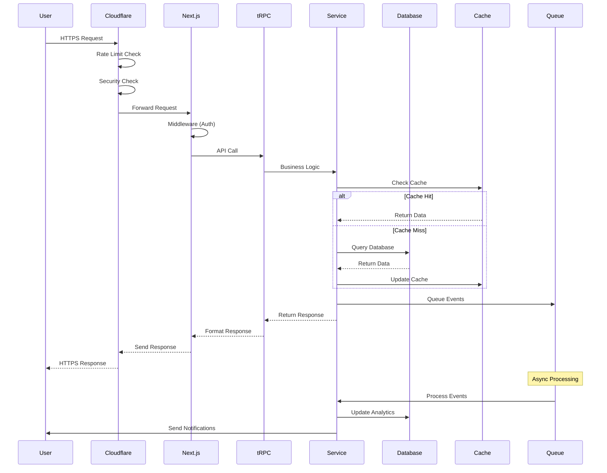

# 🏛️ Sparkle Universe - Project Architecture Document

**Version 1.0 | Date: July 31, 2025**

## 📋 Table of Contents

1. [Executive Summary](#executive-summary)
2. [Architecture Overview](#architecture-overview)
3. [Design Principles](#design-principles)
4. [Technology Stack Deep Dive](#technology-stack-deep-dive)
5. [System Architecture](#system-architecture)
6. [Data Architecture](#data-architecture)
7. [API Architecture](#api-architecture)
8. [Security Architecture](#security-architecture)
9. [Performance Architecture](#performance-architecture)
10. [Frontend Architecture](#frontend-architecture)
11. [Backend Architecture](#backend-architecture)
12. [Real-time Architecture](#real-time-architecture)
13. [Development Guidelines](#development-guidelines)
14. [Step-by-Step Implementation Guide](#step-by-step-implementation-guide)
15. [Testing Strategy](#testing-strategy)
16. [Deployment Architecture](#deployment-architecture)
17. [Monitoring & Observability](#monitoring--observability)
18. [Disaster Recovery](#disaster-recovery)

## Executive Summary

This document serves as the definitive architectural blueprint for Sparkle Universe, a next-generation community platform for Sparkle YouTube fans. It provides comprehensive technical guidance for developers to build, maintain, and scale the platform while adhering to best practices and architectural principles.

### Document Purpose

- **Blueprint**: Complete technical specification for implementation
- **Reference**: Authoritative source for architectural decisions
- **Guide**: Step-by-step instructions for developers
- **Standards**: Coding and design standards enforcement

### Key Architectural Decisions

1. **Microservices-Ready Monolith**: Start with a well-structured monolith that can be decomposed into microservices
2. **Edge-First Design**: Leverage edge computing for global performance
3. **Event-Driven Architecture**: Use event sourcing for complex state management
4. **API-First Development**: Design APIs before implementation
5. **Progressive Enhancement**: Build for resilience and accessibility

## Architecture Overview

### High-Level Architecture

```
┌─────────────────────────────────────────────────────────────────────────┐
│                              Client Layer                                │
│  ┌────────────┐  ┌────────────┐  ┌────────────┐  ┌─────────────────┐  │
│  │    Web     │  │   Mobile   │  │  Desktop   │  │  External APIs  │  │
│  │ (Next.js)  │  │ (React     │  │ (Electron) │  │  (Webhooks)     │  │
│  │            │  │  Native)   │  │            │  │                 │  │
│  └──────┬─────┘  └─────┬──────┘  └─────┬──────┘  └────────┬────────┘  │
└─────────┼──────────────┼───────────────┼───────────────────┼───────────┘
          │              │               │                   │
          ▼              ▼               ▼                   ▼
┌─────────────────────────────────────────────────────────────────────────┐
│                           API Gateway Layer                              │
│  ┌─────────────────────────────────────────────────────────────────┐   │
│  │                    Cloudflare Edge Network                       │   │
│  │  ┌─────────────┐  ┌──────────────┐  ┌───────────────────────┐  │   │
│  │  │ Rate Limiter│  │ WAF/Security │  │ Load Balancer         │  │   │
│  │  └─────────────┘  └──────────────┘  └───────────────────────┘  │   │
│  └─────────────────────────────────────────────────────────────────┘   │
└─────────────────────────────────────────────────────────────────────────┘
                                    │
                                    ▼
┌─────────────────────────────────────────────────────────────────────────┐
│                         Application Layer                                │
│  ┌─────────────────────────────────────────────────────────────────┐   │
│  │                      Next.js Application                         │   │
│  │  ┌──────────────┐  ┌──────────────┐  ┌────────────────────┐   │   │
│  │  │ App Router   │  │ API Routes   │  │ Middleware         │   │   │
│  │  │ (React RSC)  │  │ (tRPC)       │  │ (Auth/Security)    │   │   │
│  │  └──────────────┘  └──────────────┘  └────────────────────┘   │   │
│  └─────────────────────────────────────────────────────────────────┘   │
└─────────────────────────────────────────────────────────────────────────┘
                                    │
                                    ▼
┌─────────────────────────────────────────────────────────────────────────┐
│                           Service Layer                                  │
│  ┌───────────────┐  ┌────────────────┐  ┌─────────────────────────┐   │
│  │ Auth Service  │  │ User Service   │  │ Content Service         │   │
│  ├───────────────┤  ├────────────────┤  ├─────────────────────────┤   │
│  │ Analytics     │  │ Notification   │  │ YouTube Integration     │   │
│  │ Service       │  │ Service        │  │ Service                 │   │
│  ├───────────────┤  ├────────────────┤  ├─────────────────────────┤   │
│  │ AI/ML Service │  │ Real-time      │  │ Gamification Service    │   │
│  │               │  │ Service        │  │                         │   │
│  └───────────────┘  └────────────────┘  └─────────────────────────┘   │
└─────────────────────────────────────────────────────────────────────────┘
                                    │
                                    ▼
┌─────────────────────────────────────────────────────────────────────────┐
│                            Data Layer                                    │
│  ┌────────────────┐  ┌────────────────┐  ┌─────────────────────────┐  │
│  │  PostgreSQL    │  │  Redis Cache   │  │  S3 Object Storage      │  │
│  │  (Primary DB)  │  │  (Session/     │  │  (Media/Files)          │  │
│  │                │  │   Real-time)   │  │                         │  │
│  ├────────────────┤  ├────────────────┤  ├─────────────────────────┤  │
│  │  Elasticsearch │  │  Message Queue │  │  CDN                    │  │
│  │  (Search)      │  │  (Bull/Redis)  │  │  (CloudFront)           │  │
│  └────────────────┘  └────────────────┘  └─────────────────────────┘  │
└─────────────────────────────────────────────────────────────────────────┘
```

### Component Interaction Flow



## Design Principles

### 1. Domain-Driven Design (DDD)

```typescript
// src/domain/user/entities/user.entity.ts
export class User {
  private constructor(
    private readonly id: UserId,
    private email: Email,
    private username: Username,
    private profile: UserProfile,
    private settings: UserSettings
  ) {}

  static create(props: CreateUserProps): Result<User> {
    // Domain validation logic
    const emailOrError = Email.create(props.email);
    if (emailOrError.isFailure) {
      return Result.fail(emailOrError.error);
    }
    // ... more validation
    return Result.ok(new User(...));
  }

  // Domain methods
  updateProfile(updates: ProfileUpdates): Result<void> {
    // Business logic here
  }

  // Domain events
  addDomainEvent(event: DomainEvent): void {
    this.domainEvents.push(event);
  }
}
```

### 2. Clean Architecture Layers

```
src/
├── domain/              # Enterprise Business Rules
│   ├── user/           # User aggregate
│   ├── content/        # Content aggregate
│   └── gamification/   # Gamification aggregate
├── application/         # Application Business Rules
│   ├── use-cases/      # Use case implementations
│   └── services/       # Application services
├── infrastructure/      # Frameworks & Drivers
│   ├── db/            # Database implementation
│   ├── api/           # External API clients
│   └── messaging/     # Message queue implementation
└── presentation/        # Interface Adapters
    ├── api/           # REST/GraphQL/tRPC
    └── web/           # React components
```

### 3. SOLID Principles

#### Single Responsibility
```typescript
// src/services/email/email.service.ts
export class EmailService {
  constructor(private readonly mailer: IMailer) {}
  
  async sendWelcomeEmail(user: User): Promise<void> {
    // Only responsible for sending welcome emails
  }
}

// src/services/notification/notification.service.ts
export class NotificationService {
  constructor(
    private readonly emailService: EmailService,
    private readonly pushService: PushService
  ) {}
  
  async notifyUser(notification: Notification): Promise<void> {
    // Orchestrates different notification channels
  }
}
```

#### Open/Closed Principle
```typescript
// src/services/storage/storage.interface.ts
export interface IStorageService {
  upload(file: File): Promise<FileUrl>;
  delete(url: FileUrl): Promise<void>;
}

// src/services/storage/s3.storage.ts
export class S3StorageService implements IStorageService {
  // S3 implementation
}

// src/services/storage/cloudinary.storage.ts
export class CloudinaryStorageService implements IStorageService {
  // Cloudinary implementation
}
```

### 4. Event-Driven Architecture

```typescript
// src/events/domain-events.ts
export abstract class DomainEvent {
  public dateTimeOccurred: Date;
  public aggregateId: string;

  constructor(aggregateId: string) {
    this.dateTimeOccurred = new Date();
    this.aggregateId = aggregateId;
  }

  abstract getEventName(): string;
}

// src/events/user/user-created.event.ts
export class UserCreatedEvent extends DomainEvent {
  constructor(
    public readonly userId: string,
    public readonly email: string,
    public readonly username: string
  ) {
    super(userId);
  }

  getEventName(): string {
    return 'user.created';
  }
}

// src/events/handlers/user-created.handler.ts
export class UserCreatedHandler implements IEventHandler<UserCreatedEvent> {
  constructor(
    private readonly emailService: EmailService,
    private readonly analyticsService: AnalyticsService
  ) {}

  async handle(event: UserCreatedEvent): Promise<void> {
    // Send welcome email
    await this.emailService.sendWelcomeEmail(event);
    
    // Track analytics
    await this.analyticsService.track('user_signup', {
      userId: event.userId
    });
  }
}
```

## Technology Stack Deep Dive

### Frontend Technologies

#### Next.js 15 with App Router
```typescript
// src/app/layout.tsx
import { Metadata } from 'next'

export const metadata: Metadata = {
  title: 'Sparkle Universe',
  description: 'Where fans become stars',
}

export default function RootLayout({
  children,
}: {
  children: React.ReactNode
}) {
  return (
    <html lang="en">
      <body>
        <Providers>
          {children}
        </Providers>
      </body>
    </html>
  )
}
```

#### TypeScript Configuration
```json
// tsconfig.json
{
  "compilerOptions": {
    "target": "ES2022",
    "lib": ["dom", "dom.iterable", "esnext"],
    "allowJs": true,
    "skipLibCheck": true,
    "strict": true,
    "forceConsistentCasingInFileNames": true,
    "noEmit": true,
    "esModuleInterop": true,
    "module": "esnext",
    "moduleResolution": "bundler",
    "resolveJsonModule": true,
    "isolatedModules": true,
    "jsx": "preserve",
    "incremental": true,
    "plugins": [
      {
        "name": "next"
      }
    ],
    "paths": {
      "@/*": ["./src/*"],
      "@/components/*": ["./src/components/*"],
      "@/lib/*": ["./src/lib/*"],
      "@/hooks/*": ["./src/hooks/*"],
      "@/types/*": ["./src/types/*"],
      "@/server/*": ["./src/server/*"]
    }
  },
  "include": ["next-env.d.ts", "**/*.ts", "**/*.tsx", ".next/types/**/*.ts"],
  "exclude": ["node_modules"]
}
```

#### Tailwind CSS Configuration
```typescript
// tailwind.config.ts
import type { Config } from 'tailwindcss'

const config: Config = {
  darkMode: 'class',
  content: [
    './src/**/*.{js,ts,jsx,tsx,mdx}',
  ],
  theme: {
    extend: {
      colors: {
        sparkle: {
          50: '#fff0f0',
          100: '#ffe0e0',
          // ... complete color palette
          900: '#7f1d1d',
        },
      },
      animation: {
        'sparkle': 'sparkle 3s linear infinite',
        'glow': 'glow 2s ease-in-out infinite alternate',
        'float': 'float 6s ease-in-out infinite',
      },
      keyframes: {
        sparkle: {
          '0%, 100%': { opacity: '0' },
          '50%': { opacity: '1' },
        },
        glow: {
          'from': { boxShadow: '0 0 10px #ff6b6b, 0 0 20px #ff6b6b' },
          'to': { boxShadow: '0 0 20px #ff6b6b, 0 0 30px #ff6b6b' },
        },
        float: {
          '0%, 100%': { transform: 'translateY(0)' },
          '50%': { transform: 'translateY(-20px)' },
        },
      },
    },
  },
  plugins: [
    require('@tailwindcss/forms'),
    require('@tailwindcss/typography'),
    require('tailwindcss-animate'),
  ],
}

export default config
```

### Backend Technologies

#### Prisma Schema Design
shared earlier in full. please refer to the `prisma/schema.prisma` file shared earlier.

#### tRPC Router Architecture
```typescript
// src/server/api/root.ts
import { createTRPCRouter } from '@/server/api/trpc'
import { userRouter } from '@/server/api/routers/user'
import { postRouter } from '@/server/api/routers/post'
import { authRouter } from '@/server/api/routers/auth'
import { adminRouter } from '@/server/api/routers/admin'

export const appRouter = createTRPCRouter({
  user: userRouter,
  post: postRouter,
  auth: authRouter,
  admin: adminRouter,
})

export type AppRouter = typeof appRouter

// src/server/api/routers/post.ts
import { z } from 'zod'
import { createTRPCRouter, publicProcedure, protectedProcedure } from '@/server/api/trpc'
import { PostService } from '@/services/post.service'

export const postRouter = createTRPCRouter({
  create: protectedProcedure
    .input(z.object({
      title: z.string().min(1).max(200),
      content: z.string().min(1),
      tags: z.array(z.string()).optional(),
      categoryId: z.string().optional(),
      youtubeVideoId: z.string().optional(),
    }))
    .mutation(async ({ ctx, input }) => {
      const postService = new PostService(ctx.db)
      return postService.createPost({
        ...input,
        authorId: ctx.session.user.id,
      })
    }),

  list: publicProcedure
    .input(z.object({
      limit: z.number().min(1).max(100).default(10),
      cursor: z.string().optional(),
      filter: z.object({
        authorId: z.string().optional(),
        categoryId: z.string().optional(),
        tag: z.string().optional(),
        featured: z.boolean().optional(),
      }).optional(),
    }))
    .query(async ({ ctx, input }) => {
      const postService = new PostService(ctx.db)
      return postService.listPosts(input)
    }),

  get: publicProcedure
    .input(z.object({
      slug: z.string(),
    }))
    .query(async ({ ctx, input }) => {
      const postService = new PostService(ctx.db)
      return postService.getPostBySlug(input.slug)
    }),
})
```

## System Architecture

### Service Layer Design

```typescript
// src/services/base.service.ts
export abstract class BaseService {
  constructor(protected readonly db: PrismaClient) {}
  
  protected async transaction<T>(
    fn: (tx: Prisma.TransactionClient) => Promise<T>
  ): Promise<T> {
    return this.db.$transaction(fn)
  }
}

// src/services/post.service.ts
export class PostService extends BaseService {
  constructor(
    db: PrismaClient,
    private readonly cacheService: CacheService,
    private readonly searchService: SearchService,
    private readonly eventBus: EventBus
  ) {
    super(db)
  }

  async createPost(input: CreatePostInput): Promise<Post> {
    return this.transaction(async (tx) => {
      // Create post
      const post = await tx.post.create({
        data: {
          ...input,
          slug: await this.generateUniqueSlug(input.title),
        },
        include: {
          author: true,
          tags: true,
          category: true,
        },
      })

      // Index for search
      await this.searchService.indexPost(post)

      // Publish event
      await this.eventBus.publish(new PostCreatedEvent(post))

      // Cache
      await this.cacheService.set(`post:${post.slug}`, post)

      return post
    })
  }

  async getPostBySlug(slug: string): Promise<Post | null> {
    // Try cache first
    const cached = await this.cacheService.get<Post>(`post:${slug}`)
    if (cached) return cached

    // Query database
    const post = await this.db.post.findUnique({
      where: { slug },
      include: {
        author: true,
        tags: true,
        category: true,
        _count: {
          select: {
            comments: true,
            reactions: true,
          },
        },
      },
    })

    if (post) {
      // Update cache
      await this.cacheService.set(`post:${slug}`, post, 3600) // 1 hour
    }

    return post
  }

  private async generateUniqueSlug(title: string): Promise<string> {
    const baseSlug = title
      .toLowerCase()
      .replace(/[^a-z0-9]+/g, '-')
      .replace(/(^-|-$)/g, '')

    let slug = baseSlug
    let counter = 1

    while (await this.db.post.findUnique({ where: { slug } })) {
      slug = `${baseSlug}-${counter}`
      counter++
    }

    return slug
  }
}
```

### Repository Pattern Implementation

```typescript
// src/repositories/base.repository.ts
export interface IRepository<T> {
  findById(id: string): Promise<T | null>
  findMany(filter: any): Promise<T[]>
  create(data: any): Promise<T>
  update(id: string, data: any): Promise<T>
  delete(id: string): Promise<void>
}

// src/repositories/user.repository.ts
export class UserRepository implements IRepository<User> {
  constructor(private readonly db: PrismaClient) {}

  async findById(id: string): Promise<User | null> {
    return this.db.user.findUnique({
      where: { id },
      include: {
        profile: true,
        achievements: {
          include: {
            achievement: true,
          },
        },
      },
    })
  }

  async findByEmail(email: string): Promise<User | null> {
    return this.db.user.findUnique({
      where: { email },
      include: {
        profile: true,
      },
    })
  }

  async create(data: CreateUserData): Promise<User> {
    return this.db.user.create({
      data,
      include: {
        profile: true,
      },
    })
  }

  // ... other methods
}
```

## Data Architecture

### Database Design Principles

1. **Normalization**: 3NF for transactional data
2. **Denormalization**: Strategic denormalization for read performance
3. **Indexing Strategy**: Index based on query patterns
4. **Partitioning**: Time-based partitioning for large tables

### Caching Strategy

```typescript
// src/lib/cache/cache.service.ts
export class CacheService {
  private redis: Redis
  private localCache: NodeCache

  constructor() {
    this.redis = new Redis(process.env.REDIS_URL)
    this.localCache = new NodeCache({ stdTTL: 60 }) // 1 minute local cache
  }

  async get<T>(key: string): Promise<T | null> {
    // L1 Cache - Local
    const local = this.localCache.get<T>(key)
    if (local) return local

    // L2 Cache - Redis
    const cached = await this.redis.get(key)
    if (cached) {
      const parsed = JSON.parse(cached) as T
      this.localCache.set(key, parsed)
      return parsed
    }

    return null
  }

  async set<T>(key: string, value: T, ttl?: number): Promise<void> {
    const serialized = JSON.stringify(value)
    
    // Set in both caches
    this.localCache.set(key, value)
    
    if (ttl) {
      await this.redis.setex(key, ttl, serialized)
    } else {
      await this.redis.set(key, serialized)
    }
  }

  async invalidate(pattern: string): Promise<void> {
    // Clear local cache
    const keys = this.localCache.keys()
    keys.forEach(key => {
      if (key.includes(pattern)) {
        this.localCache.del(key)
      }
    })

    // Clear Redis cache
    const redisKeys = await this.redis.keys(`*${pattern}*`)
    if (redisKeys.length > 0) {
      await this.redis.del(...redisKeys)
    }
  }
}
```

### Search Architecture

```typescript
// src/lib/search/search.service.ts
import { Client } from '@elastic/elasticsearch'

export class SearchService {
  private client: Client

  constructor() {
    this.client = new Client({
      node: process.env.ELASTICSEARCH_URL,
      auth: {
        apiKey: process.env.ELASTICSEARCH_API_KEY
      }
    })
  }

  async indexPost(post: Post): Promise<void> {
    await this.client.index({
      index: 'posts',
      id: post.id,
      body: {
        title: post.title,
        content: this.extractTextFromRichContent(post.content),
        excerpt: post.excerpt,
        author: post.author.username,
        tags: post.tags.map(t => t.name),
        category: post.category?.name,
        publishedAt: post.publishedAt,
        score: this.calculateRelevanceScore(post),
      }
    })
  }

  async search(query: string, options: SearchOptions): Promise<SearchResult> {
    const response = await this.client.search({
      index: 'posts',
      body: {
        query: {
          multi_match: {
            query,
            fields: ['title^3', 'content', 'excerpt^2', 'tags^2'],
            type: 'best_fields',
            fuzziness: 'AUTO'
          }
        },
        highlight: {
          fields: {
            title: {},
            content: { fragment_size: 150 }
          }
        },
        size: options.limit || 10,
        from: options.offset || 0
      }
    })

    return this.formatSearchResults(response)
  }
}
```

## API Architecture

### RESTful API Design

```typescript
// src/app/api/v1/posts/route.ts
import { NextRequest, NextResponse } from 'next/server'
import { z } from 'zod'
import { withAuth } from '@/lib/api/middleware'
import { PostService } from '@/services/post.service'

const createPostSchema = z.object({
  title: z.string().min(1).max(200),
  content: z.string().min(1),
  tags: z.array(z.string()).optional(),
})

export const POST = withAuth(async (req: NextRequest) => {
  try {
    const body = await req.json()
    const validated = createPostSchema.parse(body)
    
    const postService = new PostService()
    const post = await postService.createPost({
      ...validated,
      authorId: req.user.id
    })

    return NextResponse.json({
      success: true,
      data: post
    }, { status: 201 })
  } catch (error) {
    if (error instanceof z.ZodError) {
      return NextResponse.json({
        success: false,
        error: 'Validation failed',
        details: error.errors
      }, { status: 400 })
    }

    return NextResponse.json({
      success: false,
      error: 'Internal server error'
    }, { status: 500 })
  }
})
```

### GraphQL Schema

```graphql
# src/graphql/schema.graphql
type User {
  id: ID!
  username: String!
  email: String!
  profile: Profile
  posts(limit: Int, offset: Int): PostConnection!
  followers: [User!]!
  following: [User!]!
  level: Int!
  experience: Int!
  achievements: [Achievement!]!
  createdAt: DateTime!
}

type Post {
  id: ID!
  slug: String!
  title: String!
  content: String!
  excerpt: String
  author: User!
  tags: [Tag!]!
  category: Category
  comments(limit: Int, offset: Int): CommentConnection!
  reactions: [Reaction!]!
  views: Int!
  createdAt: DateTime!
  updatedAt: DateTime!
}

type Query {
  me: User
  user(username: String!): User
  post(slug: String!): Post
  posts(filter: PostFilter, limit: Int, offset: Int): PostConnection!
  search(query: String!, type: SearchType): SearchResult!
}

type Mutation {
  createPost(input: CreatePostInput!): Post!
  updatePost(id: ID!, input: UpdatePostInput!): Post!
  deletePost(id: ID!): Boolean!
  followUser(userId: ID!): User!
  unfollowUser(userId: ID!): User!
  likePost(postId: ID!): Post!
  unlikePost(postId: ID!): Post!
}

type Subscription {
  postCreated(authorId: ID): Post!
  commentAdded(postId: ID!): Comment!
  notificationReceived: Notification!
}
```

## Security Architecture

### Authentication & Authorization

```typescript
// src/lib/auth/auth.config.ts
import { NextAuthOptions } from 'next-auth'
import GoogleProvider from 'next-auth/providers/google'
import CredentialsProvider from 'next-auth/providers/credentials'
import { PrismaAdapter } from '@auth/prisma-adapter'
import { db } from '@/server/db'
import bcrypt from 'bcryptjs'

export const authOptions: NextAuthOptions = {
  adapter: PrismaAdapter(db),
  session: {
    strategy: 'jwt',
    maxAge: 30 * 24 * 60 * 60, // 30 days
  },
  providers: [
    GoogleProvider({
      clientId: process.env.GOOGLE_CLIENT_ID!,
      clientSecret: process.env.GOOGLE_CLIENT_SECRET!,
      allowDangerousEmailAccountLinking: true,
    }),
    CredentialsProvider({
      name: 'credentials',
      credentials: {
        email: { label: 'Email', type: 'email' },
        password: { label: 'Password', type: 'password' }
      },
      async authorize(credentials) {
        if (!credentials?.email || !credentials?.password) {
          throw new Error('Invalid credentials')
        }

        const user = await db.user.findUnique({
          where: { email: credentials.email }
        })

        if (!user || !user.hashedPassword) {
          throw new Error('Invalid credentials')
        }

        const isValid = await bcrypt.compare(
          credentials.password,
          user.hashedPassword
        )

        if (!isValid) {
          throw new Error('Invalid credentials')
        }

        return {
          id: user.id,
          email: user.email,
          username: user.username,
          image: user.image,
        }
      }
    })
  ],
  callbacks: {
    async session({ token, session }) {
      if (token) {
        session.user.id = token.id
        session.user.username = token.username
        session.user.role = token.role
      }
      return session
    },
    async jwt({ token, user }) {
      if (user) {
        token.id = user.id
        token.username = user.username
        token.role = user.role
      }
      return token
    }
  },
  pages: {
    signIn: '/login',
    signOut: '/logout',
    error: '/auth/error',
    verifyRequest: '/auth/verify',
  },
  debug: process.env.NODE_ENV === 'development',
}
```

### API Security Middleware

```typescript
// src/lib/api/security.ts
import { NextRequest, NextResponse } from 'next/server'
import { RateLimiter } from '@/lib/rate-limiter'
import { SecurityHeaders } from '@/lib/security-headers'

export async function securityMiddleware(req: NextRequest) {
  // CORS
  const origin = req.headers.get('origin')
  const allowedOrigins = process.env.ALLOWED_ORIGINS?.split(',') || []
  
  if (origin && !allowedOrigins.includes(origin)) {
    return new NextResponse(null, { status: 403 })
  }

  // Rate limiting
  const rateLimiter = new RateLimiter()
  const identifier = req.ip || 'anonymous'
  
  if (!await rateLimiter.checkLimit(identifier)) {
    return new NextResponse('Too many requests', { status: 429 })
  }

  // Security headers
  const response = NextResponse.next()
  SecurityHeaders.apply(response)

  return response
}

// src/lib/security-headers.ts
export class SecurityHeaders {
  static apply(response: NextResponse) {
    response.headers.set('X-Frame-Options', 'DENY')
    response.headers.set('X-Content-Type-Options', 'nosniff')
    response.headers.set('X-XSS-Protection', '1; mode=block')
    response.headers.set('Referrer-Policy', 'strict-origin-when-cross-origin')
    response.headers.set(
      'Content-Security-Policy',
      "default-src 'self'; script-src 'self' 'unsafe-eval' 'unsafe-inline' https://www.googletagmanager.com; style-src 'self' 'unsafe-inline'; img-src 'self' data: https:; font-src 'self' data:; connect-src 'self' https://api.sparkle-universe.com wss://ws.sparkle-universe.com; frame-src 'self' https://www.youtube.com"
    )
    response.headers.set(
      'Permissions-Policy',
      'camera=(), microphone=(), geolocation=(), interest-cohort=()'
    )
  }
}
```

### Data Encryption

```typescript
// src/lib/encryption/encryption.service.ts
import crypto from 'crypto'

export class EncryptionService {
  private algorithm = 'aes-256-gcm'
  private secretKey: Buffer

  constructor() {
    this.secretKey = Buffer.from(process.env.ENCRYPTION_KEY!, 'hex')
  }

  encrypt(text: string): EncryptedData {
    const iv = crypto.randomBytes(16)
    const cipher = crypto.createCipheriv(this.algorithm, this.secretKey, iv)
    
    let encrypted = cipher.update(text, 'utf8', 'hex')
    encrypted += cipher.final('hex')
    
    const authTag = cipher.getAuthTag()

    return {
      encrypted,
      iv: iv.toString('hex'),
      authTag: authTag.toString('hex')
    }
  }

  decrypt(data: EncryptedData): string {
    const decipher = crypto.createDecipheriv(
      this.algorithm,
      this.secretKey,
      Buffer.from(data.iv, 'hex')
    )
    
    decipher.setAuthTag(Buffer.from(data.authTag, 'hex'))
    
    let decrypted = decipher.update(data.encrypted, 'hex', 'utf8')
    decrypted += decipher.final('utf8')
    
    return decrypted
  }

  hashPassword(password: string): Promise<string> {
    return bcrypt.hash(password, 12)
  }

  verifyPassword(password: string, hash: string): Promise<boolean> {
    return bcrypt.compare(password, hash)
  }
}
```

## Performance Architecture

### Optimization Strategies

```typescript
// src/lib/performance/optimization.ts
export class PerformanceOptimizer {
  // Image optimization
  static optimizeImage(url: string, options: ImageOptions): string {
    const params = new URLSearchParams({
      w: options.width.toString(),
      h: options.height.toString(),
      q: options.quality?.toString() || '75',
      fm: options.format || 'webp',
    })
    
    return `${process.env.NEXT_PUBLIC_IMAGE_CDN}/${url}?${params}`
  }

  // Database query optimization
  static async batchQueries<T>(
    ids: string[],
    fetcher: (ids: string[]) => Promise<T[]>
  ): Promise<Map<string, T>> {
    const chunks = chunk(ids, 100) // Batch in groups of 100
    const results = await Promise.all(
      chunks.map(chunk => fetcher(chunk))
    )
    
    const map = new Map<string, T>()
    results.flat().forEach(item => {
      map.set(item.id, item)
    })
    
    return map
  }

  // Request deduplication
  static deduplicate<T>(
    key: string,
    fetcher: () => Promise<T>
  ): Promise<T> {
    if (this.pending.has(key)) {
      return this.pending.get(key)!
    }

    const promise = fetcher().finally(() => {
      this.pending.delete(key)
    })

    this.pending.set(key, promise)
    return promise
  }

  private static pending = new Map<string, Promise<any>>()
}
```

### CDN Configuration

```typescript
// src/lib/cdn/cdn.config.ts
export const cdnConfig = {
  // Static assets
  static: {
    domain: process.env.NEXT_PUBLIC_STATIC_CDN,
    maxAge: 31536000, // 1 year
    swr: 86400, // 1 day stale-while-revalidate
  },

  // Dynamic content
  dynamic: {
    domain: process.env.NEXT_PUBLIC_DYNAMIC_CDN,
    maxAge: 3600, // 1 hour
    swr: 300, // 5 minutes stale-while-revalidate
  },

  // Image optimization
  images: {
    domains: ['sparkle-universe.com', 'cloudinary.com'],
    deviceSizes: [640, 750, 828, 1080, 1200, 1920, 2048, 3840],
    imageSizes: [16, 32, 48, 64, 96, 128, 256, 384],
    formats: ['image/webp', 'image/avif'],
  },

  // Cache keys
  cacheKeys: {
    post: (slug: string) => `post:${slug}`,
    user: (username: string) => `user:${username}`,
    feed: (userId: string, page: number) => `feed:${userId}:${page}`,
  },
}
```

## Frontend Architecture

### Component Structure

```typescript
// src/components/features/post/post-card.tsx
import { memo } from 'react'
import { Card } from '@/components/ui/card'
import { Avatar } from '@/components/ui/avatar'
import { PostActions } from './post-actions'
import { YouTubeEmbed } from '@/components/features/youtube/youtube-embed'
import { formatDistanceToNow } from 'date-fns'

interface PostCardProps {
  post: Post
  onLike?: (postId: string) => void
  onComment?: (postId: string) => void
  onShare?: (postId: string) => void
}

export const PostCard = memo<PostCardProps>(({ 
  post, 
  onLike, 
  onComment, 
  onShare 
}) => {
  return (
    <Card className="group relative overflow-hidden transition-all hover:shadow-xl">
      {/* Gradient border effect */}
      <div className="absolute inset-0 bg-gradient-to-r from-sparkle-500 to-sparkle-700 opacity-0 group-hover:opacity-100 transition-opacity" />
      
      <div className="relative bg-background m-[1px] rounded-lg p-6">
        {/* Author info */}
        <div className="flex items-center gap-3 mb-4">
          <Avatar
            src={post.author.image}
            alt={post.author.username}
            className="ring-2 ring-sparkle-500/20"
          />
          <div>
            <h4 className="font-semibold">{post.author.username}</h4>
            <p className="text-sm text-muted-foreground">
              {formatDistanceToNow(post.createdAt, { addSuffix: true })}
            </p>
          </div>
        </div>

        {/* Content */}
        <h3 className="text-xl font-bold mb-2 line-clamp-2">
          {post.title}
        </h3>
        
        {post.excerpt && (
          <p className="text-muted-foreground mb-4 line-clamp-3">
            {post.excerpt}
          </p>
        )}

        {/* YouTube embed if available */}
        {post.youtubeVideoId && (
          <YouTubeEmbed 
            videoId={post.youtubeVideoId}
            className="mb-4"
          />
        )}

        {/* Tags */}
        <div className="flex flex-wrap gap-2 mb-4">
          {post.tags.map(tag => (
            <span
              key={tag.id}
              className="px-2 py-1 text-xs rounded-full bg-sparkle-100 dark:bg-sparkle-900 text-sparkle-700 dark:text-sparkle-300"
            >
              #{tag.name}
            </span>
          ))}
        </div>

        {/* Actions */}
        <PostActions
          postId={post.id}
          likes={post._count.reactions}
          comments={post._count.comments}
          isLiked={post.isLikedByCurrentUser}
          onLike={onLike}
          onComment={onComment}
          onShare={onShare}
        />
      </div>
    </Card>
  )
})

PostCard.displayName = 'PostCard'
```

### State Management

```typescript
// src/store/index.ts
import { create } from 'zustand'
import { devtools, persist } from 'zustand/middleware'
import { immer } from 'zustand/middleware/immer'

interface AppState {
  // User state
  user: User | null
  setUser: (user: User | null) => void
  
  // UI state
  theme: 'light' | 'dark' | 'system'
  setTheme: (theme: AppState['theme']) => void
  
  // Notification state
  notifications: Notification[]
  addNotification: (notification: Notification) => void
  markAsRead: (id: string) => void
  
  // Real-time state
  onlineUsers: Set<string>
  setOnlineUsers: (users: string[]) => void
}

export const useStore = create<AppState>()(
  devtools(
    persist(
      immer((set) => ({
        // Initial state
        user: null,
        theme: 'system',
        notifications: [],
        onlineUsers: new Set(),

        // Actions
        setUser: (user) =>
          set((state) => {
            state.user = user
          }),

        setTheme: (theme) =>
          set((state) => {
            state.theme = theme
          }),

        addNotification: (notification) =>
          set((state) => {
            state.notifications.unshift(notification)
          }),

        markAsRead: (id) =>
          set((state) => {
            const notification = state.notifications.find(n => n.id === id)
            if (notification) {
              notification.read = true
            }
          }),

        setOnlineUsers: (users) =>
          set((state) => {
            state.onlineUsers = new Set(users)
          }),
      })),
      {
        name: 'sparkle-universe-store',
        partialize: (state) => ({
          theme: state.theme,
          user: state.user,
        }),
      }
    )
  )
)
```

### Custom Hooks

```typescript
// src/hooks/use-infinite-posts.ts
import { useInfiniteQuery } from '@tanstack/react-query'
import { api } from '@/lib/api'

export function useInfinitePosts(filter?: PostFilter) {
  return useInfiniteQuery({
    queryKey: ['posts', filter],
    queryFn: async ({ pageParam = 0 }) => {
      const response = await api.post.list.query({
        limit: 10,
        offset: pageParam,
        filter,
      })
      return response
    },
    getNextPageParam: (lastPage, pages) => {
      if (lastPage.length < 10) return undefined
      return pages.length * 10
    },
    staleTime: 5 * 60 * 1000, // 5 minutes
    cacheTime: 10 * 60 * 1000, // 10 minutes
  })
}

// src/hooks/use-real-time.ts
import { useEffect } from 'react'
import { io, Socket } from 'socket.io-client'
import { useStore } from '@/store'

let socket: Socket | null = null

export function useRealTime() {
  const { user, addNotification, setOnlineUsers } = useStore()

  useEffect(() => {
    if (!user) return

    // Initialize socket connection
    socket = io(process.env.NEXT_PUBLIC_WS_URL!, {
      auth: {
        token: user.token,
      },
    })

    // Event listeners
    socket.on('notification', (notification) => {
      addNotification(notification)
    })

    socket.on('users:online', (users) => {
      setOnlineUsers(users)
    })

    socket.on('post:created', (post) => {
      // Invalidate relevant queries
      queryClient.invalidateQueries(['posts'])
    })

    // Cleanup
    return () => {
      socket?.disconnect()
      socket = null
    }
  }, [user])

  return {
    emit: (event: string, data: any) => socket?.emit(event, data),
    on: (event: string, handler: (...args: any[]) => void) => {
      socket?.on(event, handler)
      return () => socket?.off(event, handler)
    },
  }
}
```

## Backend Architecture

### Service Architecture Pattern

```typescript
// src/application/use-cases/create-post.use-case.ts
export class CreatePostUseCase {
  constructor(
    private postRepository: IPostRepository,
    private tagService: TagService,
    private notificationService: NotificationService,
    private eventBus: IEventBus
  ) {}

  async execute(input: CreatePostInput): Promise<Result<Post>> {
    // Validate input
    const validation = this.validateInput(input)
    if (validation.isFailure) {
      return Result.fail(validation.error)
    }

    // Create post entity
    const postOrError = Post.create({
      title: input.title,
      content: input.content,
      authorId: input.authorId,
      excerpt: this.generateExcerpt(input.content),
    })

    if (postOrError.isFailure) {
      return Result.fail(postOrError.error)
    }

    const post = postOrError.getValue()

    // Process tags
    if (input.tags) {
      const tags = await this.tagService.findOrCreateTags(input.tags)
      post.addTags(tags)
    }

    // Save to database
    try {
      const savedPost = await this.postRepository.save(post)

      // Publish domain events
      const events = post.getUncommittedEvents()
      await this.eventBus.publishAll(events)

      // Send notifications
      await this.notificationService.notifyFollowers(
        savedPost.authorId,
        'New post published',
        savedPost
      )

      return Result.ok(savedPost)
    } catch (error) {
      return Result.fail('Failed to create post')
    }
  }

  private validateInput(input: CreatePostInput): Result<void> {
    if (!input.title || input.title.length < 1) {
      return Result.fail('Title is required')
    }

    if (!input.content || input.content.length < 10) {
      return Result.fail('Content must be at least 10 characters')
    }

    return Result.ok()
  }

  private generateExcerpt(content: string): string {
    // Strip HTML and truncate
    const text = content.replace(/<[^>]*>/g, '')
    return text.length > 200 ? text.substring(0, 197) + '...' : text
  }
}
```

### Queue Processing

```typescript
// src/infrastructure/queue/queue.service.ts
import Bull from 'bull'
import { EmailProcessor } from './processors/email.processor'
import { ImageProcessor } from './processors/image.processor'
import { NotificationProcessor } from './processors/notification.processor'

export class QueueService {
  private queues: Map<string, Bull.Queue> = new Map()

  constructor() {
    this.initializeQueues()
  }

  private initializeQueues() {
    // Email queue
    const emailQueue = new Bull('email', {
      redis: process.env.REDIS_URL,
      defaultJobOptions: {
        attempts: 3,
        backoff: {
          type: 'exponential',
          delay: 2000,
        },
      },
    })

    emailQueue.process(new EmailProcessor().process)
    this.queues.set('email', emailQueue)

    // Image processing queue
    const imageQueue = new Bull('image', {
      redis: process.env.REDIS_URL,
      defaultJobOptions: {
        attempts: 2,
        timeout: 30000,
      },
    })

    imageQueue.process(new ImageProcessor().process)
    this.queues.set('image', imageQueue)

    // Notification queue
    const notificationQueue = new Bull('notification', {
      redis: process.env.REDIS_URL,
    })

    notificationQueue.process(new NotificationProcessor().process)
    this.queues.set('notification', notificationQueue)
  }

  async addJob(queueName: string, data: any, options?: Bull.JobOptions) {
    const queue = this.queues.get(queueName)
    if (!queue) {
      throw new Error(`Queue ${queueName} not found`)
    }

    return queue.add(data, options)
  }

  async getQueue(name: string): Promise<Bull.Queue | undefined> {
    return this.queues.get(name)
  }
}

// src/infrastructure/queue/processors/email.processor.ts
export class EmailProcessor {
  async process(job: Bull.Job) {
    const { type, to, data } = job.data

    switch (type) {
      case 'welcome':
        await this.sendWelcomeEmail(to, data)
        break
      case 'password-reset':
        await this.sendPasswordResetEmail(to, data)
        break
      case 'notification':
        await this.sendNotificationEmail(to, data)
        break
      default:
        throw new Error(`Unknown email type: ${type}`)
    }
  }

  private async sendWelcomeEmail(to: string, data: any) {
    // Email sending logic
  }

  private async sendPasswordResetEmail(to: string, data: any) {
    // Email sending logic
  }

  private async sendNotificationEmail(to: string, data: any) {
    // Email sending logic
  }
}
```

## Real-time Architecture

### WebSocket Implementation

```typescript
// src/server/websocket/websocket.server.ts
import { Server } from 'socket.io'
import { createAdapter } from '@socket.io/redis-adapter'
import { Redis } from 'ioredis'
import { authMiddleware } from './middleware/auth.middleware'
import { PostHandlers } from './handlers/post.handlers'
import { NotificationHandlers } from './handlers/notification.handlers'

export class WebSocketServer {
  private io: Server

  constructor(server: any) {
    this.io = new Server(server, {
      cors: {
        origin: process.env.ALLOWED_ORIGINS?.split(','),
        credentials: true,
      },
      transports: ['websocket', 'polling'],
    })

    // Redis adapter for horizontal scaling
    const pubClient = new Redis(process.env.REDIS_URL!)
    const subClient = pubClient.duplicate()
    this.io.adapter(createAdapter(pubClient, subClient))

    // Middleware
    this.io.use(authMiddleware)

    // Initialize handlers
    this.initializeHandlers()
  }

  private initializeHandlers() {
    this.io.on('connection', (socket) => {
      console.log(`User ${socket.data.userId} connected`)

      // Join user's personal room
      socket.join(`user:${socket.data.userId}`)

      // Join followed users' rooms
      this.joinFollowedUsersRooms(socket)

      // Register handlers
      PostHandlers.register(socket, this.io)
      NotificationHandlers.register(socket, this.io)

      // Handle disconnection
      socket.on('disconnect', () => {
        console.log(`User ${socket.data.userId} disconnected`)
        this.updateOnlineStatus(socket.data.userId, false)
      })

      // Update online status
      this.updateOnlineStatus(socket.data.userId, true)
    })
  }

  private async joinFollowedUsersRooms(socket: any) {
    const followedUsers = await this.getFollowedUsers(socket.data.userId)
    followedUsers.forEach(userId => {
      socket.join(`user:${userId}:posts`)
    })
  }

  private async updateOnlineStatus(userId: string, isOnline: boolean) {
    if (isOnline) {
      await this.redis.sadd('online_users', userId)
    } else {
      await this.redis.srem('online_users', userId)
    }

    // Broadcast updated online users list
    const onlineUsers = await this.redis.smembers('online_users')
    this.io.emit('users:online', onlineUsers)
  }

  // Public methods for emitting events from other services
  emitToUser(userId: string, event: string, data: any) {
    this.io.to(`user:${userId}`).emit(event, data)
  }

  emitToRoom(room: string, event: string, data: any) {
    this.io.to(room).emit(event, data)
  }

  broadcast(event: string, data: any) {
    this.io.emit(event, data)
  }
}

// src/server/websocket/handlers/post.handlers.ts
export class PostHandlers {
  static register(socket: any, io: Server) {
    // Like post in real-time
    socket.on('post:like', async (postId: string) => {
      try {
        const result = await postService.likePost(
          postId,
          socket.data.userId
        )

        // Emit to all users viewing this post
        io.to(`post:${postId}`).emit('post:liked', {
          postId,
          userId: socket.data.userId,
          likesCount: result.likesCount,
        })
      } catch (error) {
        socket.emit('error', { message: 'Failed to like post' })
      }
    })

    // Join post room for real-time updates
    socket.on('post:join', (postId: string) => {
      socket.join(`post:${postId}`)
    })

    // Leave post room
    socket.on('post:leave', (postId: string) => {
      socket.leave(`post:${postId}`)
    })

    // Real-time commenting
    socket.on('comment:create', async (data: any) => {
      try {
        const comment = await commentService.createComment({
          ...data,
          authorId: socket.data.userId,
        })

        // Emit to all users viewing this post
        io.to(`post:${data.postId}`).emit('comment:created', comment)
      } catch (error) {
        socket.emit('error', { message: 'Failed to create comment' })
      }
    })
  }
}
```

## Development Guidelines

### Code Style Guide

```typescript
// ✅ Good: Clear naming and single responsibility
export class UserService {
  constructor(
    private readonly userRepository: IUserRepository,
    private readonly eventBus: IEventBus
  ) {}

  async createUser(input: CreateUserInput): Promise<Result<User>> {
    // Implementation
  }
}

// ❌ Bad: Unclear naming and multiple responsibilities
export class Service {
  async doStuff(data: any): Promise<any> {
    // Too generic
  }
}

// ✅ Good: Type-safe error handling
export class Result<T> {
  private constructor(
    public isSuccess: boolean,
    public error?: string,
    private value?: T
  ) {}

  static ok<U>(value?: U): Result<U> {
    return new Result<U>(true, undefined, value)
  }

  static fail<U>(error: string): Result<U> {
    return new Result<U>(false, error)
  }

  getValue(): T {
    if (!this.isSuccess) {
      throw new Error(this.error)
    }
    return this.value!
  }
}

// ✅ Good: Clear component structure
export const PostCard: FC<PostCardProps> = ({ post, onLike }) => {
  // Hooks at the top
  const [isLiking, setIsLiking] = useState(false)
  const { user } = useAuth()

  // Event handlers
  const handleLike = useCallback(async () => {
    setIsLiking(true)
    try {
      await onLike(post.id)
    } finally {
      setIsLiking(false)
    }
  }, [post.id, onLike])

  // Early returns for edge cases
  if (!post) return null

  // Main render
  return (
    <Card>
      {/* Component content */}
    </Card>
  )
}
```

### Testing Strategy

```typescript
// src/tests/unit/services/post.service.test.ts
describe('PostService', () => {
  let postService: PostService
  let mockRepository: jest.Mocked<IPostRepository>
  let mockEventBus: jest.Mocked<IEventBus>

  beforeEach(() => {
    mockRepository = createMockRepository()
    mockEventBus = createMockEventBus()
    postService = new PostService(mockRepository, mockEventBus)
  })

  describe('createPost', () => {
    it('should create a post successfully', async () => {
      // Arrange
      const input = {
        title: 'Test Post',
        content: 'Test content',
        authorId: 'user123',
      }
      
      mockRepository.save.mockResolvedValue(createMockPost(input))

      // Act
      const result = await postService.createPost(input)

      // Assert
      expect(result.isSuccess).toBe(true)
      expect(result.getValue().title).toBe(input.title)
      expect(mockRepository.save).toHaveBeenCalledWith(
        expect.objectContaining({
          title: input.title,
          content: input.content,
        })
      )
      expect(mockEventBus.publish).toHaveBeenCalledWith(
        expect.any(PostCreatedEvent)
      )
    })

    it('should fail with invalid input', async () => {
      // Arrange
      const input = {
        title: '',
        content: 'Test',
        authorId: 'user123',
      }

      // Act
      const result = await postService.createPost(input)

      // Assert
      expect(result.isSuccess).toBe(false)
      expect(result.error).toBe('Title is required')
      expect(mockRepository.save).not.toHaveBeenCalled()
    })
  })
})

// src/tests/integration/api/posts.test.ts
describe('Posts API', () => {
  beforeAll(async () => {
    await setupTestDatabase()
  })

  afterAll(async () => {
    await cleanupTestDatabase()
  })

  describe('POST /api/posts', () => {
    it('should create a post', async () => {
      const response = await request(app)
        .post('/api/posts')
        .set('Authorization', `Bearer ${testUserToken}`)
        .send({
          title: 'Integration Test Post',
          content: 'This is a test post',
          tags: ['test', 'integration'],
        })

      expect(response.status).toBe(201)
      expect(response.body.success).toBe(true)
      expect(response.body.data).toMatchObject({
        title: 'Integration Test Post',
        slug: expect.stringMatching(/^integration-test-post/),
        author: {
          id: testUser.id,
          username: testUser.username,
        },
      })
    })
  })
})
```

## Step-by-Step Implementation Guide

### Phase 1: Project Foundation (Week 1-2)

#### Day 1-2: Initial Setup
```bash
# 1. Create Next.js project
npx create-next-app@latest sparkle-universe --typescript --tailwind --app

# 2. Install core dependencies
cd sparkle-universe
npm install @prisma/client prisma @tanstack/react-query zustand
npm install @trpc/client @trpc/server @trpc/react-query @trpc/next
npm install next-auth @auth/prisma-adapter
npm install zod bcryptjs jsonwebtoken
npm install --save-dev @types/bcryptjs

# 3. Setup project structure
mkdir -p src/{components,lib,hooks,server,types,styles}
mkdir -p src/components/{ui,features,layouts,providers}
mkdir -p src/server/{api,db,services}
mkdir -p src/lib/{auth,utils,constants}

# 4. Initialize Prisma
npx prisma init

# 5. Configure environment variables
cp .env.example .env.local
```

#### Day 3-4: Database Schema
```typescript
// prisma/schema.prisma
// Copy the complete schema from the Data Architecture section

// Run migrations
npx prisma generate
npx prisma migrate dev --name init

// Create seed file
// prisma/seed.ts
import { PrismaClient } from '@prisma/client'
const prisma = new PrismaClient()

async function main() {
  // Seed data
}

main()
  .catch(console.error)
  .finally(() => prisma.$disconnect())
```

#### Day 5-6: Authentication System
```typescript
// 1. Setup NextAuth
// src/lib/auth/auth.config.ts
// Copy from Security Architecture section

// 2. Create auth API route
// src/app/api/auth/[...nextauth]/route.ts
import { authOptions } from '@/lib/auth/auth.config'
import NextAuth from 'next-auth'

const handler = NextAuth(authOptions)
export { handler as GET, handler as POST }

// 3. Create auth provider
// src/components/providers/auth-provider.tsx
'use client'
import { SessionProvider } from 'next-auth/react'

export function AuthProvider({ children }: { children: React.ReactNode }) {
  return <SessionProvider>{children}</SessionProvider>
}

// 4. Create auth hooks
// src/hooks/use-auth.ts
import { useSession } from 'next-auth/react'

export function useAuth() {
  const { data: session, status } = useSession()
  return {
    user: session?.user,
    isLoading: status === 'loading',
    isAuthenticated: status === 'authenticated',
  }
}
```

#### Day 7-8: UI Component Library
```bash
# 1. Install shadcn/ui
npx shadcn-ui@latest init
npx shadcn-ui@latest add button card input form toast

# 2. Create base components
# src/components/ui/[component].tsx
# Implement each UI component with Sparkle theme

# 3. Create layout components
# src/components/layouts/navbar.tsx
# src/components/layouts/sidebar.tsx
# src/components/layouts/footer.tsx
```

#### Day 9-10: tRPC Setup
```typescript
// 1. Create tRPC instance
// src/server/api/trpc.ts
import { initTRPC } from '@trpc/server'
import { type CreateNextContextOptions } from '@trpc/server/adapters/next'
import { getServerSession } from 'next-auth'
import { authOptions } from '@/lib/auth/auth.config'
import { db } from '@/server/db'

export const createTRPCContext = async (opts: CreateNextContextOptions) => {
  const session = await getServerSession(authOptions)
  return {
    db,
    session,
    ...opts,
  }
}

const t = initTRPC.context<typeof createTRPCContext>().create({
  transformer: superjson,
})

export const createTRPCRouter = t.router
export const publicProcedure = t.procedure
export const protectedProcedure = t.procedure.use(authMiddleware)

// 2. Create root router
// src/server/api/root.ts
// Copy from API Architecture section

// 3. Create API route
// src/app/api/trpc/[trpc]/route.ts
import { fetchRequestHandler } from '@trpc/server/adapters/fetch'
import { appRouter } from '@/server/api/root'
import { createTRPCContext } from '@/server/api/trpc'

const handler = (req: Request) =>
  fetchRequestHandler({
    endpoint: '/api/trpc',
    req,
    router: appRouter,
    createContext: createTRPCContext,
  })

export { handler as GET, handler as POST }
```

### Phase 2: Core Features (Week 3-4)

#### Day 11-12: User System
```typescript
// 1. User service
// src/server/services/user.service.ts
// Implement user CRUD operations

// 2. User profile pages
// src/app/(main)/user/[username]/page.tsx
// Create profile page with posts, followers, etc.

// 3. User settings
// src/app/(main)/settings/page.tsx
// Profile editing, preferences, etc.
```

#### Day 13-14: Content Creation
```typescript
// 1. Rich text editor
// src/components/features/editor/rich-text-editor.tsx
// Implement with Tiptap or similar

// 2. Post creation page
// src/app/(main)/create/page.tsx
// Form with validation and preview

// 3. Post service
// src/server/services/post.service.ts
// CRUD operations for posts
```

#### Day 15-16: Engagement Features
```typescript
// 1. Comment system
// src/components/features/comments/comment-thread.tsx
// Nested comments with real-time updates

// 2. Like/reaction system
// src/components/features/reactions/reaction-picker.tsx
// Animated reactions

// 3. Notification system
// src/server/services/notification.service.ts
// Real-time notifications
```

### Phase 3: Advanced Features (Week 5-6)

#### Day 17-18: Real-time Features
```typescript
// 1. WebSocket server
// src/server/websocket/index.ts
// Socket.io setup

// 2. Real-time hooks
// src/hooks/use-real-time.ts
// WebSocket connection management

// 3. Live features
// Activity feed, presence, etc.
```

#### Day 19-20: YouTube Integration
```typescript
// 1. YouTube service
// src/server/services/youtube.service.ts
// YouTube API integration

// 2. Video components
// src/components/features/youtube/
// Embed, metadata display, etc.
```

#### Day 21-22: Gamification
```typescript
// 1. Achievement system
// src/server/services/achievement.service.ts
// XP calculation, badge unlocking

// 2. Gamification UI
// src/components/features/gamification/
// Progress bars, achievement popups
```

### Phase 4: Admin & Analytics (Week 7-8)

#### Day 23-24: Admin Dashboard
```typescript
// 1. Admin layout
// src/app/admin/layout.tsx
// Protected admin area

// 2. Dashboard
// src/app/admin/dashboard/page.tsx
// Analytics overview

// 3. Management pages
// User, content, settings management
```

#### Day 25-26: Moderation Tools
```typescript
// 1. Moderation queue
// src/app/admin/moderation/page.tsx
// Content review interface

// 2. AI moderation
// src/server/services/moderation.service.ts
// Automated content filtering
```

### Phase 5: Performance & Polish (Week 9-10)

#### Day 27-28: Performance Optimization
```typescript
// 1. Implement caching
// Redis integration, query optimization

// 2. Image optimization
// Next.js Image component usage

// 3. Bundle optimization
// Code splitting, lazy loading
```

#### Day 29-30: Testing & Documentation
```typescript
// 1. Write tests
// Unit, integration, E2E tests

// 2. Documentation
// API docs, component stories

// 3. Deployment preparation
// Environment setup, CI/CD
```

## Testing Strategy

### Unit Testing

```typescript
// jest.config.js
module.exports = {
  preset: 'ts-jest',
  testEnvironment: 'node',
  roots: ['<rootDir>/src'],
  testMatch: ['**/__tests__/**/*.ts', '**/?(*.)+(spec|test).ts'],
  transform: {
    '^.+\\.ts$': 'ts-jest',
  },
  collectCoverageFrom: [
    'src/**/*.ts',
    '!src/**/*.d.ts',
    '!src/**/*.test.ts',
  ],
  coverageThreshold: {
    global: {
      branches: 80,
      functions: 80,
      lines: 80,
      statements: 80,
    },
  },
}
```

### E2E Testing

```typescript
// cypress/e2e/auth.cy.ts
describe('Authentication', () => {
  it('should login successfully', () => {
    cy.visit('/login')
    cy.get('[data-testid=email-input]').type('test@example.com')
    cy.get('[data-testid=password-input]').type('password123')
    cy.get('[data-testid=login-button]').click()
    cy.url().should('eq', Cypress.config().baseUrl + '/')
    cy.get('[data-testid=user-menu]').should('exist')
  })
})
```

## Deployment Architecture

### Production Infrastructure

```yaml
# docker-compose.prod.yml
version: '3.8'

services:
  app:
    build:
      context: .
      dockerfile: Dockerfile
    environment:
      - NODE_ENV=production
      - DATABASE_URL=${DATABASE_URL}
    ports:
      - "3000:3000"
    depends_on:
      - db
      - redis

  db:
    image: postgres:16-alpine
    environment:
      - POSTGRES_DB=sparkle_universe
      - POSTGRES_USER=${DB_USER}
      - POSTGRES_PASSWORD=${DB_PASSWORD}
    volumes:
      - postgres_data:/var/lib/postgresql/data

  redis:
    image: redis:7-alpine
    command: redis-server --appendonly yes
    volumes:
      - redis_data:/data

  nginx:
    image: nginx:alpine
    ports:
      - "80:80"
      - "443:443"
    volumes:
      - ./nginx.conf:/etc/nginx/nginx.conf
      - ./ssl:/etc/nginx/ssl
    depends_on:
      - app

volumes:
  postgres_data:
  redis_data:
```

### CI/CD Pipeline

```yaml
# .github/workflows/deploy.yml
name: Deploy

on:
  push:
    branches: [main]

jobs:
  test:
    runs-on: ubuntu-latest
    steps:
      - uses: actions/checkout@v3
      - uses: actions/setup-node@v3
        with:
          node-version: '20'
      - run: npm ci
      - run: npm run test
      - run: npm run build

  deploy:
    needs: test
    runs-on: ubuntu-latest
    steps:
      - uses: actions/checkout@v3
      - uses: vercel/action@v2
        with:
          vercel-token: ${{ secrets.VERCEL_TOKEN }}
          vercel-org-id: ${{ secrets.VERCEL_ORG_ID }}
          vercel-project-id: ${{ secrets.VERCEL_PROJECT_ID }}
```

## Monitoring & Observability

### Application Monitoring

```typescript
// src/lib/monitoring/monitoring.service.ts
import { Sentry } from '@sentry/nextjs'
import { Analytics } from '@vercel/analytics'

export class MonitoringService {
  static init() {
    // Sentry for error tracking
    Sentry.init({
      dsn: process.env.SENTRY_DSN,
      environment: process.env.NODE_ENV,
      tracesSampleRate: 1.0,
    })

    // Custom performance monitoring
    if (typeof window !== 'undefined') {
      window.addEventListener('error', (event) => {
        this.logError(event.error)
      })

      // Web Vitals
      this.trackWebVitals()
    }
  }

  static trackWebVitals() {
    if ('PerformanceObserver' in window) {
      const observer = new PerformanceObserver((list) => {
        for (const entry of list.getEntries()) {
          Analytics.track('web-vitals', {
            name: entry.name,
            value: entry.value,
            rating: entry.rating,
          })
        }
      })

      observer.observe({ entryTypes: ['web-vital'] })
    }
  }

  static logError(error: Error, context?: any) {
    Sentry.captureException(error, {
      extra: context,
    })
  }

  static trackEvent(name: string, properties?: any) {
    Analytics.track(name, properties)
  }
}
```

## Disaster Recovery

### Backup Strategy

```bash
#!/bin/bash
# scripts/backup.sh

# Database backup
pg_dump $DATABASE_URL > backup_$(date +%Y%m%d_%H%M%S).sql

# Upload to S3
aws s3 cp backup_*.sql s3://sparkle-universe-backups/

# Clean old backups
find . -name "backup_*.sql" -mtime +7 -delete

# Backup user uploads
aws s3 sync s3://sparkle-universe-uploads s3://sparkle-universe-backups/uploads/
```

### Recovery Procedures

1. **Database Recovery**
   - Restore from latest backup
   - Apply transaction logs
   - Verify data integrity

2. **Application Recovery**
   - Deploy from last known good commit
   - Restore environment variables
   - Clear caches
   - Run health checks

3. **Data Recovery**
   - Restore user uploads from S3
   - Rebuild search indices
   - Regenerate cache

## Conclusion

This architecture document provides a comprehensive blueprint for building Sparkle Universe. By following these guidelines and implementing the described patterns, developers can create a robust, scalable, and maintainable platform that delivers exceptional user experiences while maintaining high code quality and system reliability.

Remember: Architecture is a living document. As the platform evolves, this document should be updated to reflect new patterns, technologies, and lessons learned.

---

**Ready to build something amazing? Let's create the future of fan communities together! 🌟**
